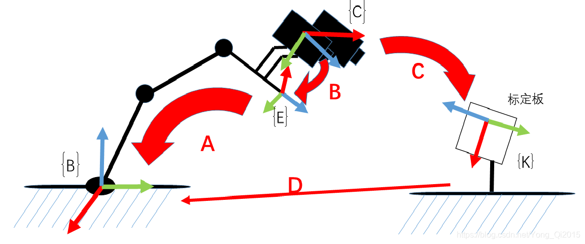
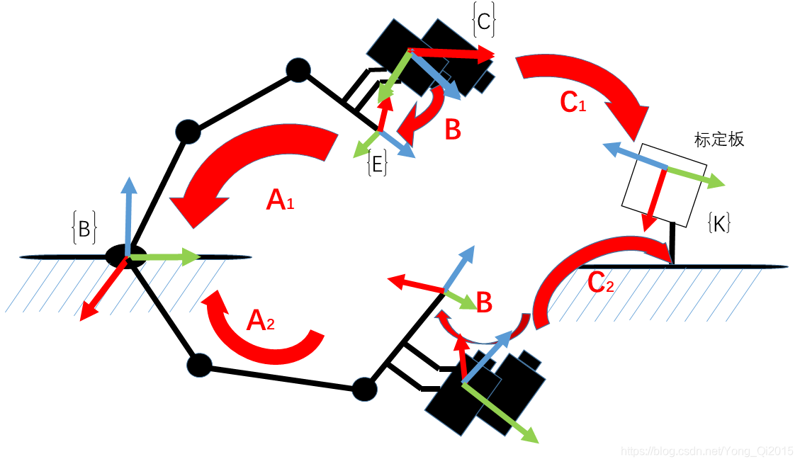

> [!warning] 阅读说明
> 本文是笔者基于特定课程、项目代码与个人学习过程整理的工作笔记。部分论断可能不完整、过时或依赖特定版本，请结合原始论文、官方文档及实际源码独立核验。

> 关于基础讲解，可以去看RealMan的手眼标定指南
> https://develop.realman-robotics.com/AI/developerGuide/hand/
> 以下主要是对该教程的进一步解析和与真机deploy的打通

> [!warning] 本教程主要讨论Eye-in-hand的情况
> 即得到相机与EE之间的**坐标转换关系**
## 线性代数层面的理解

- 关于图中的四个坐标系：坐标系代表的是手眼标定系统中各组分的**位姿**，对位姿的解释见[【MDP】奖励函数解构学习](../../%E7%BB%8F%E9%AA%8C%E5%88%86%E4%BA%AB/Phi%20Lab/WBC/%E3%80%90MDP%E3%80%91%E5%A5%96%E5%8A%B1%E5%87%BD%E6%95%B0%E8%A7%A3%E6%9E%84%E5%AD%A6%E4%B9%A0.md#obsidian-block-ca108c)
    - $B$ base（底座）：机械臂固定在桌子上的那个点，通常作为*world的绝对零点*
    - $E$ end（末端执行器）：<mark>机械臂的最末端，即机械臂和夹爪的连接端</mark>(<u>不是夹取中心</u>)
        - 也常被称为 ***Flange* 法兰盘坐标系**
        - 机器人如何精准让“夹取中心”对准目标？见[【Hand-Eye Calibration】 手眼标定理论与实践](#obsidian-block-656ce8)
    - ${C}$ camera（相机）：相机镜头的中心点为原点
    - ${K}$ board（标定板）：黑白格子的图案中心点
- A变换：机械臂末端在机械臂坐标系下的位姿，通过机械臂API获取（**已知**）
    - 数学表示为 $\prescript{base}{end}{M}$ ：$E$ 在 $B$ **下** 的位置（末端执行器相对于底座的位姿，或理解为把 $B$ 坐标系变换为 $E$ 的运算）
- B变换：相机相对于末端的位姿。我们讨论的Eye-in-hand情况下，相机是被螺丝死死固定在机械臂末端上的，所以这个值永远不变==>**这就是手眼标定要求解的最终目标（待求）**
    - 数学表示为$\prescript{end}{camera}{M}$：$C$ 在 $E$ **下** 的位姿
- C变换：相机在标定板坐标系下的位姿，通过相机拍照并用*视觉算法*计算得出（**已知**）
    - 数学表示为$\prescript{board}{camera}{M}$：$C$ 在 $K$ **下** 的位姿
- D变换：标定板相对于底座的位姿。底座没动，标定板放在桌子上也没动（**常量但未知**）
    - 数学表示为$\prescript{base}{board}{M}$：$K$ 在 $B$ **下** 的位姿

> [!tip] 注意，这里M的左侧上下标更换位置即图中箭头方向改变，即参考的主从关系反了一下，在数学上用逆矩阵表示
> 例如，C变换也可以用*标定板相对于相机坐标系的位置* 来表示，数学上表达为$\prescript{camera}{board}{M}$，代表从标定板坐标系出发**逆求解**相机的位置，或者说相机相对于标定板的坐标
> 	至于为什么把坐标的求解叫做变换，这本质上是从一个坐标系推导到另一个坐标系的动作
### 如何计算得到B变换？
- 首先我们要知道，多个矩阵$M$相乘，在物理意义上就是路径的连续拼接
    - 例如，“从 $B$ 到 $E$ 的变换”乘上“从 $E$ 到 $C$ 的变换”，就可以得到“从 $B$ 到 $C$ 的变换”
    - 数学上表达，即 $\prescript{base}{end}{M} \cdot \prescript{end}{camera}{M}=\prescript{base}{camera}{M}$
- 那么，对于 $B$ 的求解，我们就可以利用之前提到的**在整个标定过程中，机械臂的底座没有动，桌子上的标定板也没有动**的这个事实：$\prescript{base}{board}{M}=\prescript{base}{end}{M} \cdot \prescript{end}{camera}{M} \cdot \prescript{camera}{board}{M}$
    - 但是注意⚠️：$\prescript{camera}{board}{M}$ 和C变换的 $\prescript{board}{camera}{M}$ 的参考是反的，也就是$\prescript{camera}{board}{M}=\prescript{board}{camera}{M}^{-1}=C^{-1}$
    - 在实际计算中，为了利用D变换（$\prescript{base}{board}{M}$）这一未知常量，我们选择用更高效的“*消元联立方程求解* ”的方式：
        {width="512"}

        - 如图所示，我们让机械臂运动两个位置，保证这两个位置下都可以看到标定板，然后构建空间变换回路：$\prescript{base}{end}{M}_1 \cdot \prescript{end}{camera}{M}_1 \cdot \prescript{camera}{board}{M}_1=\prescript{base}{end}{M}_2 \cdot \prescript{end}{camera}{M}_2 \cdot \prescript{camera}{board}{M}_2$

        - 用具体的变换来化简表示就是：$A_1 \cdot B \cdot C_1^{-1}=A_2 \cdot B \cdot C_2^{-1}$

        - 移项得到：$(A_2^{-1} \cdot A_1) \cdot B=B \cdot (C_2^{-1} \cdot C_1)$

        - 这就得到了一个经典的 $AX=XB$ 问题

> [!important] ⚠️：实际真机手眼标定时，机械臂只进行 1 次运动（得到 2 个位置）通常是不够的
> 1. 仅由一次相对运动得到一个 $AX=XB$ 约束，通常不足以唯一确定 $X$。
> 2. 可解性还取决于采样姿态是否充分且非退化：
> 	- 应覆盖充分的旋转和平移变化，避免只做小角度、单一轴向或近似共面的重复运动。
> 	- 15～20 个姿态是常见工程经验，不是数学保证。
> 	- 增加有效姿态通常有助于用最小二乘等方法抑制随机测量误差；但数据重复、退化或含离群点时，“更多”并不保证精度单调提高。
>
> 结论：采集多组差异充分、非退化的姿态，并结合残差或重投影误差检查标定质量；不要只按姿态数量判断结果是否可靠。
- 求解出的$X$是一个$4 \times 4$ 齐次变换矩阵，结构应是$X = \begin{bmatrix} R & t \\ 0 & 1 \end{bmatrix}$
    - **$R$ (Rotation)**：是一个 $3 \times 3$ 的矩阵，记录了相机的**倾斜角度、旋转姿态**
    - **$t$ (Translation)**：是一个 $3 \times 1$ 的向量（比如 $[x, y, z]$），记录了相机距离机械臂末端的**上下左右前后距离**
    - **$[0, 0, 0, 1]$**：只是为了让这个矩阵能凑成 $4 \times 4$ 正方形，方便计算机进行乘法运算而加上的“数学补丁”，没有实际物理意义
### 机器人如何精准让目标进入“夹取中心” $TCP$（Tool Center Point）？

> 前面我们提到，通过多个$\prescript{B}{K}{M}=\prescript{B}{E}{M} \cdot \prescript{E}{C}{M} \cdot (\prescript{K}{C}{M})^{-1}$ （$D=A \cdot B \cdot C^{-1}$）可以得出相机坐标系和法兰盘坐标系的变换关系，即所谓手眼标定，那么如何利用这个结果呢？
- 我们可以把标定板坐标系 $K$ 变为目标物坐标系 $object$ ，这样我们就可以得出目标物相对于base（$B$）的位姿（得到目标物在世界坐标系的位姿）：$\prescript{B}{object}{M}=\prescript{B}{E}{M} \cdot \prescript{E}{C}{M} \cdot \prescript{C}{object}{M}=A \cdot B \cdot C^{-1} \tag{1}$
> [!warning] 但是得到了目标物在世界坐标系的位姿，不代表能够让夹爪成功抓取目标物
> - 对于机械臂来说，它目前只知道法兰盘坐标系，也就是它目前只能让机械臂和夹爪的连接处坐标系（$E$）符合目标物坐标系位姿（$object$）
> 	- 也就是：$\prescript{B}{E}{M}=\prescript{B}{object}{M}$
> - 要做到让夹爪夹取目标物，我们需要让夹爪的“夹取中心”和目标物的位姿一致，然后再闭合夹爪
> 	- 也就是：$\prescript{B}{TCP}{M}=\prescript{B}{object}{M}$
> 	- 这样一来，就需要机械臂在计算自己末端的法兰盘坐标系的时候，意识到末端实际上还连了一个夹爪，为了让夹爪能够到达目标物，自己的法兰盘坐标系实际上要“往后稍稍”让出位姿

- 这就需要我们得到$\prescript{E}{TCP}{M}$，即**TCP在Flange坐标系下的位姿**
    - 这个变换矩阵有两个获取渠道：
        1. **查阅 CAD 图纸：** 比如夹爪长 120mm，那它在法兰盘 Z 轴方向的平移就是 `z = 0.12m`，其余为 0。
        2. **TCP 标定：** 让夹爪尖端从 4 个不同角度触碰空间中同一个固定尖端，机械臂控制器就能自动算出这个偏差。

- 得到了TCP变换后，我们就能够在知道目标物世界坐标系下位姿 $\prescript{B}{object}{M}$ 的基础上，得出机械臂末端实际<mark>最终</mark>的应处的位姿：$\prescript{B}{E}{M}=\prescript{B}{TCP}{M} \cdot (\prescript{E}{TCP}{M})^{-1} \tag{2}$
    - 正如前面提到，由于<mark>最终</mark>夹爪的TCP位姿应该与目标物的位姿相同：$\prescript{B}{TCP}{M}=\prescript{B}{object}{M} \tag{3}$
    - 结合$(1)$, $(2)$和$(3)$，可以得出：$\prescript{B}{E}{M}=\prescript{B}{object}{M} \cdot (\prescript{E}{TCP}{M})^{-1}=(\prescript{B}{E}{M} \cdot \prescript{E}{C}{M} \cdot \prescript{C}{object}{M}) \cdot (\prescript{E}{TCP}{M})^{-1}$
    - ***直观理解***：只要确定了TCP最终应该处于什么位姿，利用 $(\prescript{E}{TCP}{M})^{-1}$ 来<mark>倒推就可以逆求解得到法兰盘坐标系应处的位置</mark>
