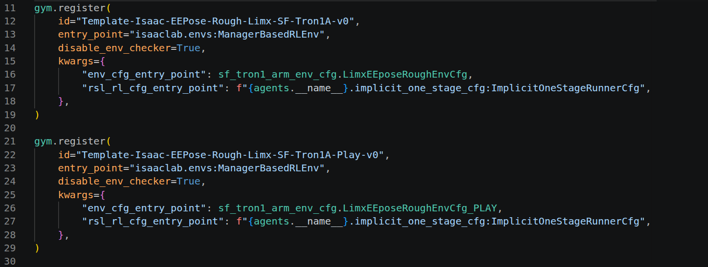

> [!warning] 阅读说明
> 本文是笔者基于特定课程、项目代码与个人学习过程整理的工作笔记。部分论断可能不完整、过时或依赖特定版本，请结合原始论文、官方文档及实际源码独立核验。

该笔记中的代码示例基于特定版本的机器人仿真与训练项目；公开版不提供私有仓库入口。
## 对各文件的理解
> [!abstract] 机器人模型文件：URDF vs MJCF
> - URDF (Unified Robot Description Format)：机器人操作系统（ROS）的绝对正统标准。定义了机器人的连杆和关节。
> 	- 项目所用实机的厂家通常会提供原生 URDF 模型。Isaac Lab内部运行的是自己的USD（Universal Scene Description 通用场景描述）格式，但它提供了一个极其强大的URDF导入器（Importer）。在实际科研中，我们都是拿厂家的URDF丢进Isaac Lab，系统会自动转成仿真能用的USD。
> - MJCF (MuJoCo XML)：另一款非常著名的物理引擎 MuJoCo 的专属格式。它在定义复杂的接触力学和肌腱驱动（比如极其逼真的人手、人体肌肉）时很有优势。
> 	- 了解即可。
### 认识 `_cfg` 文件
- cfg是Configuration（配置）的缩写，而不是Configured。在Python工程规范中，它代表这个文件是一个参数配置文件：对各种资源的调用说明
    - 其中有大量的静态赋值（例如 `self.decimation = 4`）和对内置函数的调用
> [!example] 例子1：对训练场景的定义——根本不是什么“计算逻辑”，而是纯粹的填表声明：
> ```python
> @configclass
> class MySceneCfg(InteractiveSceneCfg):
>     """Configuration for the terrain scene with a legged robot."""
>     
>     # ground terrain (地形)
>     terrain = TerrainImporterCfg(
>         prim_path="/World/ground",
>         terrain_type="generator",
>         terrain_generator=ROUGH_TERRAINS_CFG, # ⬅️ 重点！
>         ...
>     )
>     
>     # robots (机器人模型)
>	robot: ArticulationCfg = LIMX_WF_TRON1A.replace(prim_path="{ENV_REGEX_NS}/Robot") # ⬅️ 重点！
> ```
> - `ROUGH_TERRAINS_CFG` 告诉引擎，需要的是粗糙的障碍物地形，而不是平地或阶梯
> - `LIMX_WF_TRON1A` 告诉引擎，需要去资产库（assets）把逐际动力的Tron1机器人模型拿出来，放到舞台上

> [!example] 例子2：`cfg` 作为集成器，在train的时候，把物理世界（刚才创建的场景）和AI规则（Rewards/Obs）相结合
> ```python
> @configclass
> class LimxLocomotionVelocityRoughEnvCfg(ManagerBasedRLEnvCfg):
>     # Scene settings (加载刚才建好的舞台)
>     scene: MySceneCfg = MySceneCfg(num_envs=4096, env_spacing=2.5)
>     # Basic settings (各项规则管理器的“委任状”)
>     observations: ObservationsCfg = ObservationsCfg()
>     actions: ActionsCfg = ActionsCfg()
>     commands: CommandsCfg = CommandsCfg()
>     rewards: RewardsCfg = RewardsCfg()
>     terminations: TerminationsCfg = TerminationsCfg()
> ```
> - 这里的 `num_envs=4096` 说明引擎在训练的时候，后台要创造4096个平行宇宙
> - 这里的 `Basic settings` 是通过最上方的 `@configclass` 装饰器，以一种“声明式编程”告诉引擎它需要什么组件。
> 	- 例如 `actions: ActionsCfg = ActionsCfg()` ，当主程序`train.py`读到启动并读取到这个对象的时候，Isaac Lab就会自动加载、创建好配套的Action转换器

> [!example] 例子3：面向对象继承（Inheritance）
> ```python
> @configclass
> class LimxLocomotionVelocityRoughEnvCfg_PLAY(LimxLocomotionVelocityRoughEnvCfg):
> 	def __post_init__(self):
> 		# post init of parent (继承上面写过的所有规则)
> 		super().__post_init__()
> 		
> 		# make a smaller scene for play (只生成 50 个机器人)
> 		self.scene.num_envs = 50
> 		# disable randomization for play (关掉传感器噪声)
> 		self.observations.policy.enable_corruption = False
> 		# remove random pushing (关掉随机推搡)
> 		self.events.push_robot = None
> ```
> - 这个和例子2的代码中的“类（class）”长的很像，但是2是给训练（train）用的，3是给推理（play）用的
> 	- 训练时，需要4096个机器人提高训练效率，需要随机的风吹草动（noise噪声）和看不见的手去推来提高鲁棒性
> 	- 推理时，我们要看机器人走的顺不顺，可以关闭所有的干扰
> 	- 只要写一个 `_PLAY` 的类，继承训练的配置，然后把推力设置为`None`，把数量改为50就可以进行推理
### 认识 `_env` 文件（通常和 `_cfg` 同时出现）
> `env` 是environment的缩写
- 在强化学习中，世界分为两部分：
    - Environment（环境）：机器人（URDF模型 / 神经网络的`mdp`的Observations、Actions、Rewards等与环境交互的内容）+物理场景的定义（terrain等）
    - Agent（智能体）：负责训练的数字算法本身，复盘、更新神经网络
        - PPO算法的学习率（Learning_rate）+ 折扣因子（gamma=0.99）+ 广义优势估计（lam=0.95）+ 训练轮次（20k）等等
## 强化学习（RL）与`mdp`(Markov Decision Process 马尔可夫决策过程) 的核心
- 输入：Observations
    - 机器人每0.02s获取到的“传感器数据”。
    - 机器人根据Observations可以知道：当前各个关节转到了什么角度（Joint Positions）、关节转得多快（Velocities）、底盘有没有倾斜（IMU数据）、机械臂要抓去的目标点坐标在哪，等等。
    - Observations.py可以把这几十个数据打包成一个长长的向量，喂给神经网络

> [!question] `observations.py`和 `train.py`都是每隔几秒钟进行一次“操作”，二者的区别是什么？
> 参考代码：
> ```python
> def __post_init__(self):
>     """Post initialization."""
>     # general settings
>     self.decimation = 4
>     self.episode_length_s = 20.0
>     # simulation settings
>     self.sim.dt = 0.005
>     self.sim.render_interval = self.decimation
> ```
> 在Isaac Lab里，时间是分三层的（==注意，对时间戳的定义也是由 `cfg` 文件定义！==）：
> 1. 底层物理时间（Physics Steps）：
> 	- 引擎计算摩擦力、重力的时间步长（通常是 `dt=0.005` 秒）
> 	- 这是物理法则的约束，与AI的“清算”无关
> 2. AI控制的触发事件（Control Steps）—— `observations.py` 作用在这里
> 	- 神经网络的反应速度（通常设定一个降采样率 `self.decimation = 4` ），意思是物理引擎每刷新四次，AI大脑才反应过来进行一次控制（AI每 $0.005*4=0.02s$ 睁开眼睛进行一次控制）
> 	- 此时，`observations.py` 被瞬间调用。它会在这一瞬间把joint_torque（关节力矩）、target_pose_w（目标位姿）等数据抓取整合，打包成一个数组（tensor）发给神经网络，神经网络会瞬间吐出一个action矩阵来控制当前的机器人
> 3. 训练迭代周期（Iteration）—— `train.py` 作用在这里
> 	- 算法自我进化的周期。
> 	- 神经网络在0.02s的频率下，疯狂做了N次决策（即经历了N次Observations和Actions）；同时，有4096个机器人在平行宇宙中一起做
> 	- 当收集满 $N*4096$ 条 `(Obs,Action,Reward)` 元组数据后， `train.py` 就会喊停。此时仿真暂停，PPO算法开始利用这些数据计算梯度，更新一次神经网络权重
> 	- 权重更新完，终端打印出Iteration 1的日志，游戏继续
> 
> 总结：`observations.py` 负责神经网络自己调整机器人的定时控制；`train.py` 负责让算法更新神经网络这个大脑，提高机器人控制的效果 <a id="obsidian-block-05009e"></a>

- 输出：Actions
    - 神经网络经过思考之后吐出来的“控制信号”。
        - 输出通常是“目标关节角度”，例如左腿膝关节转到30度，机械臂末端往前伸5厘米之类。Isaac Lab的底层控制器（马达）会拼命把机器人驱动到这个目标位置。
> [!question] 为什么在代码库里找不到所谓的 `action.py` ?
> 因为Isaac Lab把Action的处理逻辑做成了高度标准化的内置模块，不需要独立的 `.py` 逻辑文件了——Action被配置化（Configured）了
> 解释：
> 1. 神经网络的输出：一堆-1到1的无意义纯数字（比如 `[0.5,-0.2,0.9,...]`）
> 2. Action转换器（Action Manager）：这些纯矩阵不能直接给电机。如果是控制关节位置，0.5可能代表”某关节旋转30度“。
> 3. 藏在配置里： 因为这种“按比例放大缩小”的逻辑太通用了，官方直接写好了现成的类（比如 JointPositionActionCfg）。学长不需要在 mdp 里专门建一个 `actions.py` 来写代码，他只需要在 `XX_env_cfg.py` 这个配置文件里写一行：
> 	“我要用内置的 JointPositionAction，把输出的 [-1, 1] 映射到机器人的 12 个关节上。”
> 
> 结论：Action没有独立的 `.py` 逻辑文件，正是如前面“认识 `_cfg` 文件”中所提到的，它被配置化（Configured）了

> [!Abstract] The Process：跑 `train.py` 时每 0.02 秒都在发生的故事：
> Agent持有真正的PyTorch神经网络模型，包含神经元权重矩阵
> 1. Env 的传感器睁眼，通过 `observations.py` 打包考题发给Agent。Agent大脑算一遍，把答案（Actions）上交给Environment
> 2. Action转换器会读取`_env_cfg.py`里的配置，把无意义的矩阵输出转换为真实的物理目标关节命令，这些指令会被塞给Isaac Sim底层的PhysX物理引擎，其中的虚拟马达（PD控制器）会瞬间爆发出电流和力矩，让机器人动起来  
> 3. Env 的 Reward Manager 翻开`rewards.py` 严格打分
> 4. 攒满几万条卷子后，train.py 启动 PPO 算法。PPO 精细地计算好梯度，最后命令 optimizer（Adam）：“把某个神经元权重微调”
> 
> 这就是现代具身智能仿真的底层世界观。

> [!warning] Runner、Optimizer、神经网络及其Iterations的逻辑串联与区分理解
> - 神经网络（Neural Network）：机器人的真正大脑，本质上是一堆矩阵组成的复杂方程
> 	- 它只有一个功能：向前推理（Forward *这里双向连接small project*），你给它observations，它给你actions
> 	- 但它只会做，不会看。它根本不知道自己吐出的动作效果如何，也没有能力改变自己神经元的参数，它只会基于现在神经元的各个权重进行计算，书呆子来的
> - Runner（PPO 管家 / 算法循环）：机器人训练营的总教练、指挥官
> 	- 在 `<PROJECT_ROOT>/rsl_rl/runners/implicit_os_runner.py` ，它包含了一个巨大的for循环，推着时间轴往前走（iterations是Runner读秒打印的）
> 	- 它负责把机器人们放进环境去疯狂试错，然后把机器人的表现（rewards）收集起来，放进Buffer（经验池）
> 	- 数据攒够了以后，它拿出PPO算法计算出“神经网络中的每一个神经元，应该各怎么调他们的权重，来让机器人更智能”（计算梯度gradients）
> - Optimizer（优化器-Adam）：具体对神经网络做修改的数学工具（`torch.optim.Adam`）
> 	- 前面Runner算出了具体对神经网络进行优化的ToDos，由Optimizer进行具体的手术
> 	- Adam是Optimizer这个”岗位“中最出色的员工，它不是Isaac的专属，而是PyTorch库中的一个代码类（Class），其核心代码是精妙的矩阵更新公式
> 		- 为什么说最出色呢？因为Adam并不像SGD（随机梯度下降）这种最原始的优化器，Runner让改多少就改多少（在复杂的机器人环境中，SGD会把神经网络训崩溃）
> 		- Adam拥有**自主裁量权**，对于Runner 算出来的梯度（优化建议），它会进行两步加工：
> 			1. 参考历史惯性（Momentum / 动量）：Runner 说：“这次要往左偏！” 但 Adam 翻了一下手术记录，发现过去 100 次都在往右偏，它会觉得：“这次突然让我往左，可能只是碰到了一个噪音数据（异常值）。我不能完全听你的，我只往左微调一点点，总体还是保持往右的惯性。” —— 这就是它无视/打折了 Runner 的建议
> 			2. 自适应学习率（Adaptive 机制）：Runner 给每个神经元都给出了修改建议。但 Adam 发现，有些神经元经常被修改，有些冷门神经元几百年没动过。Adam 就会自作主张地把那些冷门神经元的学习率放大，把那些频繁修改的神经元的学习率调小（`implicit_one_stage_policy.py`里定义的 `learning_rate` 是最高学习率）
> 		- 总结：Adam会根据当前的情况主动微调、忽视一些Runner给的建议
> - Iteration（迭代）：训练营里的一个完整周期
> 	- =让机器人自我调整N次 + 总教练清算并总结（得出优化结论）+ Adam选取其中的一些优化建议做更新 + 保存一次神经网络的记忆 `.pt` 文件
## PPO & Diffusion Policy
### PPO 
> 全称是 Proximal Policy Optimization（近端策略优化）。
- 它是强化学习（RL）的王者。它的学习方式是“自己瞎摸索 + 挨打/吃糖”。在 Isaac Lab 里，机器人一出生是个白痴，它乱动，摔倒了就扣分（挨打），往前走了就加分（吃糖）。PPO 算法的作用就是看着这些得分记录，小心翼翼地修改大脑，让它下次少挨打。

### Diffusion Policy扩散策略
> 模仿学习（Imitation Learning）或生成式 AI 的代表
- 回顾UMI (Universal Manipulation Interface)：人类拿着夹爪去抓杯子，录下了完美的操作轨迹（这就叫人类专家数据）。

Diffusion Policy 借用了扩散模型逐步去噪的思想：它通常不依赖强化学习奖励，而是在当前观测条件下，从带噪动作序列出发，经条件去噪生成未来一段动作（action chunk），再按滚动时域策略执行其中一部分。它学习的是专家演示分布，并不等同于只预测单个下一步动作。

### New Diffusion Policy：见[Diffusion Policy数据训练流程](../../%E7%BB%8F%E9%AA%8C%E5%88%86%E4%BA%AB/Phi%20Lab/Diffusion%20Policy/Diffusion%20Policy%E6%95%B0%E6%8D%AE%E8%AE%AD%E7%BB%83%E6%B5%81%E7%A8%8B.md)
Project计划：
    让移动与平衡部分用 PPO 训练（因为这类行为很难依靠人工演示完整覆盖，适合在仿真中通过强化学习试错）
    让机械臂操作部分用 Diffusion Policy 训练（因为精细操作更适合从人类专家演示中学习）
## 训练结束后的文件
> 跑了N个Iterations之后，你的模型学会了走路和用机械臂挥手，但是怎么保存这个“大脑”呢？

> [!abstract] `.pt` & `.onnx`
> - `.pt` 是 PyTorch 的序列化文件扩展名；它可能只保存模型权重，也可能保存完整模型，或保存包含优化器、学习率调度器和训练步数的 checkpoint 字典。具体内容取决于保存代码，不能仅凭扩展名断定一定包含梯度、优化器状态或可直接续训。
> - `.onnx` 是用于交换模型计算图和权重的开放格式，常用于跨框架推理。它不是某个平台上的独立“可执行文件”；部署时仍需匹配的 ONNX Runtime、输入预处理、输出后处理与控制器集成。
> - 两者的文件大小取决于网络结构、精度、常量与导出方式，不能保证 ONNX 一定更小，也不能据此承诺固定体积或推理速度。
>
> 因此，从训练 checkpoint 导出 ONNX 前，应先确认 checkpoint 的实际结构、模型处于推理模式、动态维度与算子是否受目标运行时支持，并在目标硬件上验证数值一致性和时延。
## 训练代码
```bash
conda activate isaaclab
python ios_train.py --headless --task=Template-Isaac-EEPose-Rough-Limx-SF-Tron1A-v0 --num_envs=N --max_iterations=M --logger=wandb
```
- 括号内填什么训练具体看： <a id="obsidian-block-7ee914"></a>
```text
<PROJECT_ROOT>/source/ext_loco/tasks/loco_manipulation/EE_pose/config/sf_tron1_arm/__init__.py
<PROJECT_ROOT>/source/ext_loco/tasks/loco_manipulation/EE_pose/config/wf_tron1_arm/__init__.py
```

> [!abstract] 关于`assets`与`--task` 之间的关系
> - **asset**指的是“仿真里被加载出来的物体资源”
> 	- 在本训练中，指的是机器人本体资源：机器人型号+机械结构+几何/碰撞/关节定义
> 
> 
> - **task**指的是“训练问题/环境定义”。每个task做什么，由 `kwargs` 里的两个入口决定：
> 	- `"env_cfg_entry_point": ...` 决定环境、机器人（robot asset）、观测（observations）、随机采样（commands）、奖励（rewards）、地形（terrain）、难度（curriculum）、终止条件（terminations）等
> 	- `"rsl_rl_cfg_entry_point": ...` 决定训练算法配置、网络结构、PPO参数、experiment name等RL config
> 
> 关于tasks如何与assets相关联，详见：[如何确定 `__init__.py` 中特定 task 选取的 robot asset](../../经验分享/Phi%20Lab/WBC/如何确定__init__.py中特定task选取的robot%20asset.md)

> [!question] 为什么不把以上的`__init__.py`放到`train.py`里？这样的话task口令直接就可以作为input确定后续的gym和入口了？
> <mark>因为这样做可以把“通用训练流程”和“具体任务注册/配置”分离开。</mark>
> - `ios_train.py` 不需要知道每个机器人、每种地形、每个算法配置具体在哪，它只负责一套通用流程：
> 	1. 解析终端输入的命令行，提取参数
> 	2. 启动Isaac Sim
> 	3. 根据 `--task=` 找到环境配置和agent配置
> 	4. `gym.make()` 创建环境
> 	5. 创建runner
> 	6. 开始训练
> - 如果把注册也写进`train.py`，那会有很多很多`if`、`elif` 和 `else`，而且长期来看：
> 	- 不仅是train，play、export等脚本都要重复维护反复出现的task映射
> 	- 任务属于哪个模块不清楚，文件结构会越来越乱
> 	- 其他IsaacLab工具也没法统一通过Gym Registry找到这些任务
> 
> 目前的注册方式其实是一个“插件系统”：
> 	- `ios_train.py` 是通用训练入口
> 	- `ios_play.py` 是通用推理入口
> 	- `EE_pose/config/sf_tron1_arm/__init__.py` 是SF Tron1A 这个机器人的仿真项目任务的注册表
> 	- `sf_tron1_arm_env_cfg.py` 是环境细节配置
> 	- `EE_pose/config/sf_tron1_arm/agents/fpo_one_stage_cfg.py` 是训练算法配置
> 
## 与之对应的推理代码
- 当然了，`play.py`和`train.py`在同一个任务下需要同一套注册信息，所以运行play.py的时候：
```bash
python ios_play.py --task=Template-Isaac-EEPose-Rough-Limx-SF-Tron1A-Play-v0 
```
## 关于`isaaclab.utils` 
- Isaac Lab 提供的公共工具模块，负责数学变换、配置保存、字典打印、文件 IO 等杂项功能
    - 在 `train.py` 里它主要用于打印视频配置和保存实验配置
    - 在 `mdp`/`observations.py` 里它主要用于四元数和坐标系变换
## Tip：关于 `kwarg`
> `kwarg` 通常是 **keyword argument** 的缩写，也就是“关键字参数”
- 可以理解为“按名字传入的参数”
> [!INFO] 前情提要
> 在 Python 里调用函数时，参数有两种常见传法：
> 
> ```python
> def greet(name, age):
>     print(name, age)
> 
> greet("Alice", 18)          # 位置参数 positional arguments
> greet(name="Alice", age=18) # 关键字参数 keyword arguments
> ```
> 
> 第二种 `name="Alice"`、`age=18` 就是 keyword arguments。它的好处是更清楚，不容易把顺序写错：
> 
> ```python
> greet(age=18, name="Alice") # 也可以，因为名字已经写明了
> ```

- `kwargs` 常见于 `**kwargs`，表示“接收任意数量的关键字参数”，函数内部会把它们收成一个字典：
```python
def make_robot(**kwargs):
    print(kwargs)

make_robot(name="tron1", speed=1.2, mode="real")

>>> {'name': 'tron1', 'speed': 1.2, 'mode': 'real'}
```

- 可以这样理解：
    - `arg` : argument 参数
    - `kwarg` : keyword argument：带名字传入的参数，比如 `mode="real"`
    - `*args`: 接收多余的位置参数，结果是 tuple 元组
    - `**kwargs`: 接收多余的关键字参数，结果是 dict 字典

> [!example] 
> ```
> video_kwargs = {
>     "video_folder": os.path.join(log_dir, "videos", "play"),
>     "step_trigger": lambda step: step == 0,
>     "video_length": args_cli.video_length,
>     "disable_logger": True,
> }
> 
> env = gym.wrappers.RecordVideo(env, **video_kwargs)
> ```
> - 这里的 `video_kwargs` 是一个字典，里面每个 key 都对应 `RecordVideo` 这个包装器需要的一个“带名字的参数”
> - 也就是说，env也可以表述为一个很复杂的代码：
> ```
> env = gym.wrappers.RecordVideo(
>     env,
>     video_folder=os.path.join(log_dir, "videos", "play"),
>     step_trigger=lambda step: step == 0,
>     video_length=args_cli.video_length,
>     disable_logger=True,
> )
> ```
> 
> 总之，这里的 `kwargs` 不是某种魔法变量名，==真正起作用的是前面的 `**`==
> 
> 变量名可以叫 `video_kwargs`，也可以叫 `record_video_options`，只要它是个字典，并且**用 `**` 展开**，就能作为 keyword arguments 传入函数。
