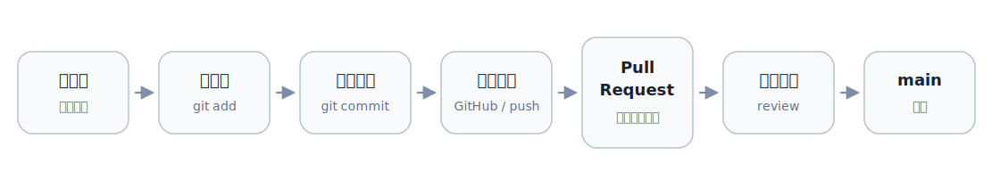

## 官方教程路线
1. GitHub 官方入门：Hello World（中文，最友好）  
https://docs.github.com/zh/get-started/start-your-journey/hello-world  
你会学会：仓库、分支、提交、拉取请求、合并。
2. GitHub 官方：关于 Git（中文，概念总览）  
https://docs.github.com/zh/get-started/using-git/about-git  
你会彻底分清 Git 和 GitHub 的关系，以及常用命令在做什么。
3. GitHub 官方：设置 Git（中文，环境与认证）  
https://docs.github.com/zh/get-started/git-basics/set-up-git  
你会完成：用户名邮箱、HTTPS 或 SSH 认证，解决“为什么 push 失败”。
4. GitHub 官方：Fork 教程（中文，开源协作必学）  
https://docs.github.com/zh/get-started/quickstart/fork-a-repo  
你会掌握：fork、上游仓库 upstream、同步 fork、提 PR。
5. 交互式练习：Learn Git Branching（中文，强烈推荐）  
https://learngitbranching.js.org/?locale=zh_CN  
特点：不是看文档，是“边输入命令边看分支图变化”。
6. GitHub Skills 互动课程（实战式）  
https://github.com/skills/introduction-to-github  
https://github.com/skills/review-pull-requests  
https://github.com/skills/resolve-merge-conflicts  
你会从“会用”进阶到“会协作”。
7. Git 权威书（中文免费）：Pro Git  
https://git-scm.com/book/zh/v2  
适合当字典，卡壳时查。
8. 速查表（中文，一页命令）  
https://training.github.com/downloads/zh_CN/github-git-cheat-sheet
9. 官方短视频（英文，短平快）  
https://git-scm.com/videos
10. 游戏化学习（可视化理解历史与分支）  
https://ohmygit.org/
## 核心概念讲透
> 把 Git 当成“时光相机”，把 GitHub 当成“云端协作平台”

1. Git 是本地版本控制工具。  
你在电脑上拍快照（commit）、开分支（branch）、回看历史（log）。
2. GitHub 是托管 Git 仓库的网站。  
你把本地历史上传到远端，和别人讨论、评审、合并。
3. 仓库就是项目 + 历史。  
它不只是文件夹，还包括所有改动记录。
4. commit 是一次快照。  
写清楚提交信息，相当于给“这张快照”起名字，方便未来回溯。
5. branch 是“平行开发线”。  
主线通常是 main。新功能放新分支，完成后合并回 main。
6. pull request 是“请求合并 + 讨论区”。  
不是单纯代码提交，而是协作流程核心：看差异、评论、审查、合并。
7. fork 是“把别人的仓库复制到你账号下”。  
适合你没有对方仓库写权限时贡献代码。
> [!important] Branch和Fork的区别
> 1. Branch 是同一个仓库里的分支
> 场景：你有仓库写权限，团队内部开发
> 2. Fork 是复制一个新仓库到你自己账号
> 场景：给别人项目提贡献，通常是开源协作
> 
> 一句话：  有权限就 branch，没权限就 fork + PR
## 一张图看懂日常流转


## Fork 协作标准流程（给别人项目贡献）
~~~bash
# 先在网页点 Fork，然后克隆你自己的 fork
git clone https://github.com/你的用户名/项目名.git
cd 项目名

# 添加上游仓库（原作者仓库）
git remote add upstream https://github.com/原作者/项目名.git
git remote -v

# 同步上游到你的 main
git fetch upstream
git switch main
git merge upstream/main
git push origin main

# 新功能分支开发
git switch -c fix/xxx
git add .
git commit -m "fix: xxx"
git push -u origin fix/xxx
# 然后到 GitHub 页面发起 Pull Request 到原仓库
~~~
## 最常见报错与解决
1. 身份认证失败（Authentication failed）  
原因：GitHub 不再支持账号密码直接做 Git 认证
解法：用 PAT 或 SSH，或者先执行 gh auth login
	PAT要去Github的Settings-->Developer Settings-->Personal access tokens中的Tokens(classic)添加

2. push 被拒绝（non-fast-forward）  
原因：远端比你新
解法：先 git pull，再解决冲突，再 git push

3. src refspec main does not match any  
原因：还没有任何提交，或分支名不对
解法：先 commit 一次；确认当前分支名

4. merge conflict  
原因：同一位置被不同分支改了
解法：编辑冲突标记，保留正确内容，add + commit
## 关于 `gh` 仓库上传和克隆下载
Ubuntu 22.04 建议用 **GitHub 官方 apt 源** 安装，不建议直接 `sudo apt install gh`，因为 Ubuntu 自带源里的 `2.4.0` 太旧；也不建议装 `gitsome`，那不是 GitHub CLI
- 直接运行：
```bash
(type -p wget >/dev/null || sudo apt update && sudo apt install wget -y)
sudo mkdir -p -m 755 /etc/apt/keyrings
wget -nv -O /tmp/githubcli-archive-keyring.gpg https://cli.github.com/packages/githubcli-archive-keyring.gpg
sudo cp /tmp/githubcli-archive-keyring.gpg /etc/apt/keyrings/githubcli-archive-keyring.gpg
sudo chmod go+r /etc/apt/keyrings/githubcli-archive-keyring.gpg

sudo mkdir -p -m 755 /etc/apt/sources.list.d
echo "deb [arch=$(dpkg --print-architecture) signed-by=/etc/apt/keyrings/githubcli-archive-keyring.gpg] https://cli.github.com/packages stable main" | sudo tee /etc/apt/sources.list.d/github-cli.list > /dev/null

sudo apt update
sudo apt install gh -y
```

然后验证：
```bash
gh --version
gh auth login
```
### 先了解git中的不同“区”
一般的项目文件夹长这样：
```
/Users/username/Documents/Projects/[your_repo]
├── README.md
├── folder1/
├── folder2/
├── requirements.txt
├── ...
├── .gitignore
└── .git/
```
可以把项目文件夹分为两部分理解：
1. `README.md`、`folder1/` 等这些真实文件 → 工作区 working tree
	- 简单来说，工作区并不是一个区域，而是当前项目文件夹中能直接编辑、运行、查看的文件
2. `.git/` 这个隐藏文件夹 → 本地 Git 仓库 local repo 的核心数据库
	
	- 本地仓库local repo实际上是 `.git/` 内部的东西，它保存：
		- `objects/`：存储commit、文件内容、目录结构等历史对象→“历史仓库”本体
		- `refs/`：存储分支名、标签名指向哪个commit
		- `logs/`：存储引用变化历史，切分支、reset、commit的记录
			- 误操作或经常靠它找回
		- `index`：暂存区，`git add .` 改的主要就是这个东西，记录“下一次 commit 准备提交哪些更改”
		- `HEAD`：存储当前的指针指向哪个分支，内容一般是 `refs/heads/main`
	- 所以对git来说，本地仓库实际上是本地`.git/`文件中的历史记录；但日常口语中，很多人也会把整个项目文件夹叫“本地仓库”
- 与之相对的，远程仓库 remote repo 是 Github 云端的 git 历史记录，因为云端没有正在打开、编辑改动的文件，所以 **Github 远程仓库没有工作区**

> [!tip]- `.gitignore` 是干嘛的
> 是我们写给 Git 看的忽略规则，比如：
> ```gitignore
> .venv/
> .vscode/
> *.log
> .env
> ```
> 这就代表当这些文件有做改动的时候，`git status` 也尽量别提醒我他们有变化，更不用说提交或拉取
> - 补充：`.git/info/exclude` 和 `.gitignore` 类似，但只对本地有效

### 下载到本地文件夹
#### 1. 第一次clone到本地新文件夹
```bash
mkdir -p <local_dir>
git clone <https://target_repo.git> <local_dir>
cd <local_dir>
git status # 查看进入的本地仓库状态：当前分支，是否有修改，是否干净
```

> [!abstract] 关于 `git clone`
> `git clone` 并不是每个分支的一整个项目文件夹都完整下载，而是下载：
> 1. 当前分支的一份工作区文件
> 2. `.git/` 里的对象数据库，也就是提交历史、文件版本、分支指针等
> 
> - 当 `git switch` 的时候，同一份文件夹里的文件会给Git改写，相当于git查看不同分支的区别然后对本地项目文件夹进行了更新：
> 	- 如果两个分支里 99% 的文件完全一样，Git 不会重复在两个分支中存 99 份一样的文件。相同内容的文件对象只存一份。
> 	- 例如 `config.yaml` 文件在 `main` 和 `dev` 这两个分支中有一个参数不同，那么git会存储 `config.yaml` 的两个版本，然后当你进行switch的时候，它把需要变化的文件从 `.git/objects` 里取出来，写到你的项目文件夹里
> 		- 不过Git底层为了省空间，可能会压缩这些差异版本：若 `config.yaml` 两个版本只有一行不同，Git 在 `.git/objects/pack/` 里可能会把它们做“差异压缩”。但这只是 Git 内部为了节省磁盘的存储优化。
> 
> 如果你只想 clone 当前分支（例如main分支），不想下载所有分支历史，可以用：
> ```
> git clone --depth 1 --single-branch --branch main https://<your_repo>.git
> ```
> 如果你还想只下载最近一次历史，进一步省空间：
> ```
> git clone --depth 1 --single-branch --branch main https://<your_repo>.git
> ```
> - 这叫 shallow clone，适合你只想运行代码，不关心完整历史。
#### 2. 更新本地项目
> 用于本地已有对应项目文件夹，但需要同步云端的更新
- 如果本地也有相对于初始clone仓库的更新，并且不想丢掉这些本地作的更新
```bash
cd <local_dir>
git status # 查看本地是否有未提交更改

# 临时保存本地所有修改，包括未被git跟踪的新文件，这样pull时候不容易和远程更新起冲突
git status -u

# 从github的main分支拉取最新代码，并把本地提交接到最新代码后面
git pull -rebase origin main
# 若输出Already up to date，的表示本地已经包含云端最新的提交了，没有东西可以更新

# 把刚才临时保存的本地修改恢复回来，如果同一个文件本地和云端都有改动，需要手动解决冲突
git stash pop
```

> [!tip]- 如何手动解决 `git stash pop` 的报错冲突
> 1. 如果本地和远程对同一文件都进行了修改（这里以 `config.py` 这个文件的冲突为例）
> 在 `git stash pop` 之后可能会出现：
> `CONFLICT (content): Merge conflict in config.py`
> 2. 查看具体是哪些文件冲突
> ```
> git status
> ```
> 会看到类似：
> ```
> both modified: config.py
> ```
> 3. 打开冲突文件
> 在具体冲突的内容处，会出现类似这种标记：
> ```
> <<<<<<< Updated upstream
> a = 1
> =======
> a = 2
> `>>>>>>> Stashed changes
> ```
> 意思是：
> ```
> <<<<<<< 到 ======= 之间：云端最新代码里的版本，通常是刚从远程拉下来的版本
> ======= 到 >>>>>>> 之间：你 stash 里恢复出来的本地版本
> ```
> 你要手动改成最终你本地想要的样子，如：
> ```
> a = 1
> ```
> **注意，要删除`<<<<<<<`等这三个冲突标记**
> 4. 标记冲突已解决
> ```
> git add config.py
> ```
> 5. 再看状态
> ```
> git status
> ```
> 6. 若没有其他冲突，就可以继续工作。如果要提交这次合并后的结果
> ```
> git commit -m "Resolve stash conflicts"
> ```
> 
> 补充：`git stash pop` 如果发生冲突，stash通常不会自动删除。确认没问题后可以看一下：`git stash list`
> 如果那个stash还在，并且你确认你不需要了：
> ```
> git stash drop
> ```

> [!abstract] `rebase` 和 `merge` 的区别: rebase比merge更整洁
> 假设 Git 历史像一条时间线。
> 一开始大家都在这里：
> ```
> A --- B
> ```
> 后来 GitHub 上别人提交了 `C`：
> ```
> A --- B --- C   origin/main
> ```
> 同时你本地也提交了 `D`：
> ```
> A --- B --- D   你的本地 main
> ```
> - 普通 `merge` 会把两条线合起来，**额外生成一个合并提交** `M`，这时历史“分叉”了：
> ```
> A --- B --- C --- M
>        \         /
>         D ------
> ```
> - `rebase` 的做法是：先把你的 `D` 暂时拿下来，把远程的 `C` 接上，然后把你的 `D` 重新放到 `C` 后面：
> ```
> A --- B --- C --- D'
> ```
> 注意这里是 `D'`，不是原来的 `D`，因为 Git 重新生成了一个内容相同但编号不同的新提交。
> 
> 总的来说，`merge` 会保留分叉和合并痕迹；`rebase` 会把历史整理成一条直线，看起来像你是在最新代码基础上继续工作的

- 如果没有本地修改
```bash
cd <local_dir>

# 如果本地和远程历史分叉，它会停止，不会自动合并提交（merge commit）
git pull --ff-only origin main
```

> [!abstract]- 如何理解 `--ff-only` 不自动产生 merge commit
> `--ff` 即 fast forward，表示“只允许快进”
> 假设你本地是：
> ```
> A --- B   main
> ```
> GitHub 是：
> ```
> A --- B --- C --- D   origin/main
> ```
> 你本地没有新提交，只是落后了。这时可以快进（Git 只是把本地 `main` 指针往前移动）：
> ```
> A --- B --- C --- D   main
> ```
> 但如果本地和远程分叉了：
> ```
> A --- B --- C   origin/main
>        \
>         D  main
> ```
> 普通 `git pull` 可能会生成一个 merge commit：
> ```
> A --- B --- C --- M
>       \         /
>         D -----
> ```
> 而：
> ```
> git pull --ff-only origin main
> ```
> 会说：不行，这不是单纯快进，我拒绝操作
> 
> 它的好处是避免你不小心生成一堆自己没意识到的 merge commit

- 如果想要云端直接覆盖本地仓库（会丢弃本地未提交修改）
```bash
cd <local_dir>
git fetch origin # 从github获取最新分支和提交信息，但暂时不修改工作区文件
git reset --hard origin/main # 强制把当前本地分支重置成github上origin/main的状态
git clean -fdx # 删除未被git跟踪的文件和文件夹，例如新建但从未git add的文件会被删除
```

> [!warning]- `git switch main` 和 `git reset --hard origin/main` 的区别
> - `git switch main` 是本地操作：
> 	- 切换本地分支
> 	- 更新本地工作区文件
> 	- 不自动联网
> 	- 不自动 fetch GitHub
> 
> 如果你本地有未保存到 commit 的修改，且切换分支会覆盖这些修改，Git 通常会拒绝切换，提醒你先 commit 或 stash
> - 而 `git reset --hard origin/main` 是强制把当前本地分支改为 Github 上的main 分支
> 	- 不切换本地分支
> 	- 自动联网到 Github 云端 main 分支
> 	- 把云端 main 内容强制覆盖到当前本地分支

### 上传到指定仓库
#### 把本地修改==更新==到云端
- **常规提交流程：**
```bash
cd <local_dir>
git status # 查看哪些文件被修改、新增或删除
git add . # 把当前目录下所有修改加入暂存区，准备提交
git commit -m "Update project" # 建议把更新内容写清楚，如完善了什么、增删了什么

# 在push前先获取云端最新代码，防止有别人提交导致push失败
git pull --rebase origin main

# 把本地main分支的提交推送给github的main分支
git push origin main
```

上面的`git push -u origin main` 之所以会上传到对应的仓库，不是因为命令里写了 GitHub 地址，而是因为本地仓库里的远端名 `origin` 已经被设置成：
```bash
https://github.com/SPIRAL-EDWIN/ARX_UMI_Hand-Eye-Calibration.git
```

远端名origin的查看可以在终端输入：
```bash
cd <task_folder_path>
git remote -v
```
也就是说：
```bash
git push -u origin main
```
逻辑等价于：把本地 main 分支，推送到 origin 这个远端对应的 GitHub 仓库里的 main 分支

- 如果要指定上传到某个 GitHub 仓库，推荐这样做：
```bash
cd <task_folder_path>

git remote set-url origin <https://your_target_repo.git>
git remote -v
git push -u origin main
```

如果不想改 `origin`，也可以新增一个远端名，比如：
```bash
# 先给该仓库地址起一个本地别名叫spiral（相比于origin）
git remote add spiral <https://your_target_repo.git>

# 然后把当前本地项目文件夹push到叫spiral的这个github云端仓库
git push -u spiral main
```

之后默认推送到哪里，取决于 `-u` 设置的 upstream。可以查看：
```bash
git branch -vv
```
#### 用本地项目覆盖云端（会强制改写远程仓库历史，多人协作时务必小心）
- 如果本地已经是git仓库：
```bash
cd <local_dir>
git status
git add .
git commit -m "Overwrite remote with local project"

# 强制把本地main推送到云端的main
git push --force-with-lease origin main
# --force-with-lease 比 --force 安全一点：如果远程有你没拉取的新提交，它会拒绝覆盖
```

- 如果本地项目还不是git仓库（相当于创建并上传云端仓库）
```
cd <local_dir>
git init # 把当前文件夹初始化成一个git仓库
git branch -M main #把当前分支命名为main

# 添加远程仓库地址，注意这里SPIRAL-EDWIN是我的username，要换成你们自己的github账号
git remote add origin https://github.com/SPIRAL-EDWIN/<repo_name>.git

git add . # 把当前项目所有文件加入暂存区
git commit -m "Initial Commit" # 第一次提交

# 把本地main强制推送到github，-u表示以后默认把本地main和远程origin/main关联起来
git push -u --force-with-lease origin main
```
