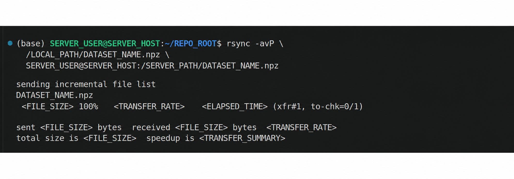

# Diffusion Policy 数据训练流程

> [!warning] 经验与安全说明
> 本文部分结论与命令来自笔者在特定软硬件版本、项目代码和实验环境中的个人实践，仅供学习与方案参考，不保证适用于其他环境，也不构成法律、专业或安全建议。执行前请核对官方文档、备份数据，并独立评估权限、设备与实验风险。

本文从 Matrix Studio 输出检查开始，依次记录 MCAP 配对、NPZ 转换、传输校验、smoke test、正式训练、监控、checkpoint 管理和离线评估。首次环境搭建见 [🦾UMI Matrix Studio配置架构](%F0%9F%A6%BEUMI_Matrix-Studio%E9%85%8D%E7%BD%AE%E6%9E%B6%E6%9E%84.md)、[RTX 50系列训练环境指南](%E5%9F%BA%E4%BA%8EUbuntu%2BRTX50%E7%B3%BB%E5%88%97%E7%9A%84UMI-diffusion-training%E6%A1%86%E6%9E%B6%E6%90%AD%E5%BB%BA%E6%8C%87%E5%8D%97.md) 与 [4090服务器训练环境指南](%E5%9F%BA%E4%BA%8EUbuntu%2B4090GPU%E6%9C%8D%E5%8A%A1%E5%99%A8%E7%9A%84UMI-diffusion-training%E6%A1%86%E6%9E%B6%E6%90%AD%E5%BB%BA%E6%8C%87%E5%8D%97.md)。

> [!important] 历史案例与模板分开
> 原笔记记录过一次具体任务。公开版本移除了任务名、run、日期、episode 数量、结果数字、账号、主机和绝对路径。下文的占位符必须在每次训练前重新赋值，不代表通用默认值。

## 0. 参数化任务身份

```bash
TASK_NAME="<TASK_NAME>"
LOCAL_REPO="<LOCAL_REPO>"
MATRIX_OUTPUT="<MATRIX_OUTPUT_ROOT>/<TASK_OUTPUT_DIR>"
LOCAL_DATASET="<LOCAL_DATASET_PATH>.npz"

SERVER_HOST="<SERVER_HOST>"
SERVER_USER="<SERVER_USER>"
SERVER_REPO="<SERVER_REPO>"
SERVER_DATASET="<SERVER_DATASET_PATH>.npz"
RUN_NAME="<RUN_NAME>"
RUN_DIR="<RUN_ROOT>/$RUN_NAME"
SMOKE_DIR="<RUN_ROOT>/smoke_$RUN_NAME"
CONDA_ENV="<CONDA_ENV>"
GPU_IDS="<GPU_IDS>"
NUM_PROCESSES="<NUM_PROCESSES>"
DATASET_FREQUENCY="<MEASURED_DATASET_FREQUENCY>"
```

`DATASET_FREQUENCY` 必须来自本批数据的实际测量或转换输出，而不是沿用历史记录中的数值。run 名、目录、tmux 会话和 W&B 目录应使用同一个 `RUN_NAME`，避免把不同 run 的配置、日志和 checkpoint 混在一起。

## 1. 流程总览

```text
Matrix Studio output
→ 精确配对源 MCAP、_vio.mcap 与状态 JSON
→ 在独立转换环境中生成 dataset.npz
→ 本机检查并记录 SHA-256
→ 上传服务器并复核 SHA-256
→ 单卡 smoke test
→ 确认退出、残余进程清空、GPU 显存释放
→ tmux 多卡正式训练
→ 监控 GPU、日志、W&B 与磁盘
→ 确认 checkpoint 与训练终止状态
→ 下载 checkpoint 并离线评估
```

## 2. 检查并精确配对 Matrix Studio 输出

```bash
find "$MATRIX_OUTPUT" -type f -name "*.mcap" | sort
find "$MATRIX_OUTPUT" -type f -name "*.json" | sort
find "$MATRIX_OUTPUT" -type f -empty
du -sh "$MATRIX_OUTPUT"
df -h "$MATRIX_OUTPUT"
```

不能只比较文件数量。应根据同一个原始 stem 建立配对表：

```text
<SOURCE_STEM>.mcap
<SOURCE_STEM>_vio.mcap
<SOURCE_STEM>_vio.json
```

只把状态明确成功、文件非空、且能与预期源 stem 精确对应的 `_vio.mcap` 加入转换输入。不要用模糊通配把其他任务、重试文件或失败残留一起送入转换脚本。若 Matrix Studio 版本使用不同命名规则，应先根据其聚合状态文件生成显式清单，再逐项核对。

## 3. 本机转换为 `dataset.npz`

> [!warning] 避免误覆盖
> 转换脚本可能删除同名输出后重写。已有 NPZ 时先复制到备份位置或更换输出名，并在运行前检查输出路径。

```bash
test -r "$MATRIX_OUTPUT"
test ! -e "$LOCAL_DATASET"

cd "$LOCAL_REPO"
conda activate "<MCAP_CONDA_ENV>"
python -c "from mcap.reader import make_reader; from mcap_protobuf.decoder import DecoderFactory; import cv2, av, zarr; print('conversion imports ok')"

python utils/mcap_to_zarr.py \
  "<EXPLICIT_VIO_INPUT_LIST_OR_DIRECTORY>" \
  -o "$LOCAL_DATASET" \
  --image-size "<IMAGE_WIDTH>,<IMAGE_HEIGHT>"

ls -lh "$LOCAL_DATASET"
sha256sum "$LOCAL_DATASET"
```

转换后记录 episode 数、总 steps、实际测得的 dataset frequency、图像尺寸与脚本 commit。脚本若打印其他机器的硬编码训练路径，只把它当作历史提示，不要直接执行。

## 4. 上传服务器并校验

{.trim-white-padding .trim-white-padding--npz-transfer}

> [!warning] 图片脱敏要求
> 上图的发布副本应遮盖用户名、主机、内部路径、任务名与传输结果数字；原始截图不应直接进入公开站点。

在本机终端执行：

```bash
rsync -avP "$LOCAL_DATASET" "${SERVER_USER}@${SERVER_HOST}:<SERVER_DATA_ROOT>/"
sha256sum "$LOCAL_DATASET"
```

在服务器终端执行：

```bash
sha256sum "$SERVER_DATASET"
stat -c%s "$SERVER_DATASET"
ls -lh "$SERVER_DATASET"
```

两端 SHA-256 必须完全一致。NPZ 是本机转换与服务器训练之间的边界；服务器通常不需要 Matrix Studio、原始 MCAP 或状态 JSON。

## 5. 单卡 smoke test

先在服务器检查代码、环境、数据与 GPU：

```bash
cd "$SERVER_REPO"
git branch --show-current
git rev-parse HEAD
git status --short

conda activate "$CONDA_ENV"
python -c "import torch; print(torch.__version__, torch.version.cuda, torch.cuda.is_available(), torch.cuda.device_count())"
test -f "$SERVER_DATASET"
nvidia-smi
nproc
```

> [!warning] 每次重新选择 GPU
> `GPU_IDS` 与 `NUM_PROCESSES` 必须根据本次 `nvidia-smi` 和调度情况设置，不得沿用历史 run 的 GPU 编号。

使用唯一目录完成最小端到端试运行。参数值需要结合当前代码配置填写：

```bash
set -e
test ! -e "$SMOKE_DIR"
mkdir -p "$SMOKE_DIR/wandb"

CUDA_VISIBLE_DEVICES="<SMOKE_GPU_ID>" \
PYTORCH_CUDA_ALLOC_CONF=expandable_segments:True \
WANDB_DIR="$SMOKE_DIR/wandb" \
python train.py \
  --config-name="<TRAIN_CONFIG_NAME>" \
  task.dataset_path="$SERVER_DATASET" \
  task.dataset_frequeny="$DATASET_FREQUENCY" \
  logging.mode=offline \
  training.resume=false \
  training.num_epochs="<SMOKE_EPOCHS>" \
  training.max_train_steps="<SMOKE_STEPS>" \
  dataloader.batch_size="<SMOKE_BATCH_SIZE>" \
  val_dataloader.batch_size="<SMOKE_BATCH_SIZE>" \
  dataloader.num_workers="<SMOKE_WORKERS>" \
  val_dataloader.num_workers="<SMOKE_WORKERS>" \
  checkpoint.save_last_ckpt=false \
  checkpoint.topk.k=0 \
  hydra.run.dir="$SMOKE_DIR/run"
```

smoke test 只验证模型构建、数据读取、前后向链路与基本写盘，不用于判断模型质量。`global_step` 与 `epoch` 的关系见 [Diffusion-policy-training中global steps和epoch的区分实例](Diffusion-policy-training%E4%B8%ADglobal%20steps%E5%92%8Cepoch%E7%9A%84%E5%8C%BA%E5%88%86%E5%AE%9E%E4%BE%8B.md)，该页面也已反向链接到本文。

> [!abstract] TopK 与 latest checkpoint
> `save_last_ckpt` 控制是否保存最新 checkpoint；`topk.k` 控制保留多少个按监控量排序的候选。若监控量是 `train_loss`，TopK 只表示训练 loss 排名，不证明 held-out 泛化最好。smoke test 若不希望写 checkpoint，需要同时关闭 latest 与 TopK。

### 5.1 退出与 GPU 释放验收

```bash
nvidia-smi
pgrep -af train.py
```

多用户服务器上可能存在其他训练。只根据用户名、启动时间、完整命令和 `SMOKE_DIR` 确认属于自己的 PID，再发送 `TERM`；不要使用会匹配所有用户任务的宽泛 `pkill`。只有在正常终止失败并确认目标无误后，才考虑更强的信号。

正式训练前必须同时满足：smoke test 正常退出、本次 run 无残留进程、目标 GPU 显存已释放。

## 6. tmux 多卡正式训练

> [!warning] 新 run 与合法 resume
> 从头训练必须使用新的 `RUN_DIR`。只有在确认 checkpoint、日志和序列化状态完整，并明确选择续训时，才复用原目录。

```bash
test ! -e "$RUN_DIR"
mkdir -p "$RUN_DIR/wandb"
tmux new -s "$RUN_NAME"
```

在 tmux 中使用同一组身份变量启动训练：

```bash
cd "$SERVER_REPO"
conda activate "$CONDA_ENV"

CUDA_VISIBLE_DEVICES="$GPU_IDS" \
PYTORCH_CUDA_ALLOC_CONF=expandable_segments:True \
WANDB_DIR="$RUN_DIR/wandb" \
accelerate launch \
  --num_processes "$NUM_PROCESSES" \
  --gpu_ids "$GPU_IDS" \
  --num_machines 1 \
  --dynamo_backend no \
  train.py \
  --config-name="<TRAIN_CONFIG_NAME>" \
  task.dataset_path="$SERVER_DATASET" \
  task.dataset_frequeny="$DATASET_FREQUENCY" \
  logging.mode=offline \
  training.num_epochs="<TRAIN_EPOCHS>" \
  training.resume=false \
  dataloader.batch_size="<BATCH_SIZE_PER_PROCESS>" \
  val_dataloader.batch_size="<VAL_BATCH_SIZE_PER_PROCESS>" \
  dataloader.num_workers="<WORKERS_PER_PROCESS>" \
  val_dataloader.num_workers="<VAL_WORKERS_PER_PROCESS>" \
  checkpoint.save_last_ckpt=true \
  checkpoint.topk.k="<TOPK_COUNT>" \
  hydra.run.dir="$RUN_DIR"
```

混合精度、batch、workers 与 allocator 设置都依赖当前代码和硬件。若某个 commit 已知存在 GradScaler 或 mixed-precision 问题，应保持已验证设置，并把限制与 commit 一起记录，而不是把经验推广为所有版本的结论。

## 7. OOM 处理顺序

1. 检查是否存在属于自己的残留进程。
2. 降低每进程训练 batch。
3. 降低 validation batch。
4. 需要保持有效 batch 时，再增加 gradient accumulation。
5. 检查 activation、图像尺寸与模型结构等主要显存来源。
6. 调整 mixed precision 前，先确认当前训练循环支持对应 scaler 与 dtype。

`num_workers` 主要影响 CPU、内存与 I/O，通常不是首要显存参数。公开版本不保留历史硬件的实测显存表。

## 8. 监控训练

```bash
tmux ls
tmux attach -t "$RUN_NAME"
watch -n "<REFRESH_SECONDS>" nvidia-smi
tail -f "$RUN_DIR/logs.json.txt"
df -h "<SERVER_DATA_ROOT>"
du -sh "$RUN_DIR"
```

`Ctrl+B` 后按 `D` 只会离开 tmux；`Ctrl+C` 会中断当前前台训练。中止后重新检查进程和 GPU，只处理已确认属于自己的 PID。

## 9. 训练完成与 checkpoint

```bash
sed -n '1,220p' "$RUN_DIR/.hydra/config.yaml"
cat "$RUN_DIR/.hydra/overrides.yaml"
tail -n "<TAIL_LINES>" "$RUN_DIR/logs.json.txt"
ls -lh "$RUN_DIR/checkpoints"
```

完成条件应由配置、最后记录的 epoch/global step、进程自然退出状态与 checkpoint 完整性共同判断。TopK 文件可能因排名更新而淘汰更早候选；其保留时间点不能反推出“训练到某个 epoch 才开始保存”。

## 10. 是否需要 resume

checkpoint 能否续训取决于项目的序列化内容。除模型或 EMA 权重外，还需核对 optimizer、scheduler、scaler、epoch/global step、随机状态以及 dataloader/sampler 状态是否被保存和恢复。不能把 `resume=false` 或文件后缀本身当作“必然不能/可以续训”的充分证据。

正式长训练前，应在同一 commit 上做一次短程保存—恢复测试，并确认恢复后 loss、step 与调度器状态连续。

## 11. 下载 checkpoint 并校验

```bash
LOCAL_CHECKPOINT_DIR="<LOCAL_CHECKPOINT_DIR>"
mkdir -p "$LOCAL_CHECKPOINT_DIR"
rsync -avP \
  "${SERVER_USER}@${SERVER_HOST}:$RUN_DIR/checkpoints/<CHECKPOINT_NAME>.ckpt" \
  "$LOCAL_CHECKPOINT_DIR/"
```

分别在服务器和本机计算 SHA-256，两端必须一致。

## 12. 保存实验身份

```bash
REPRO_DIR="$RUN_DIR/reproducibility"
mkdir -p "$REPRO_DIR"

cd "$SERVER_REPO"
git branch --show-current > "$REPRO_DIR/git-branch.txt"
git rev-parse HEAD > "$REPRO_DIR/git-commit.txt"
git status --short > "$REPRO_DIR/git-status-short.txt"
sha256sum "$SERVER_DATASET" > "$REPRO_DIR/dataset-sha256.txt"
nvidia-smi > "$REPRO_DIR/nvidia-smi.txt"
python -m pip freeze > "$REPRO_DIR/requirements-lock.txt"
```

私有实验记录中可保存任务名、采集日期、episode 数、dataset steps/frequency、GPU、完整命令、run 与 checkpoint 策略；公开发布时应继续泛化这些身份与结果。

## 13. 日常训练 Checklist

- ☐ 精确核对 `_vio.mcap`、状态 JSON、聚合记录与空文件。
- ☐ 使用显式配对清单生成新的 NPZ，未覆盖旧数据集。
- ☐ 记录本机 NPZ 的大小、SHA-256 与实测 frequency。
- ☐ 上传服务器并确认两端 SHA-256 一致。
- ☐ 检查服务器 branch、commit、工作区、磁盘与 GPU。
- ☐ 使用唯一目录完成单卡无 checkpoint smoke test。
- ☐ 确认 smoke test 退出、无残留进程、GPU 已释放。
- ☐ 让 run、tmux、W&B、Hydra 和 checkpoint 使用同一身份。
- ☐ 明确本次是否要求 resume，并先做保存—恢复测试。
- ☐ 监控日志、GPU、W&B 与磁盘。
- ☐ 确认自然退出状态和 checkpoint 完整性。
- ☐ 下载 checkpoint 并复核 SHA-256。
- ☐ 进入 [Diffusion Policy checkpoint 数值与可视化评估流程](Diffusion%20Policy%20checkpoint%20%E6%95%B0%E5%80%BC%E4%B8%8E%E5%8F%AF%E8%A7%86%E5%8C%96%E8%AF%84%E4%BC%B0%E6%B5%81%E7%A8%8B.md)。
