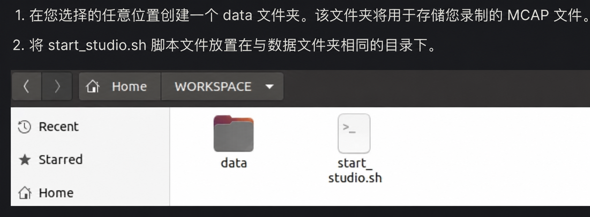

# 🦾 UMI Matrix Studio 配置架构

> [!warning] 经验与安全说明
> 本文部分结论与命令来自笔者在特定软硬件版本、项目代码和实验环境中的个人实践，仅供学习与方案参考，不保证适用于其他环境，也不构成法律、专业或安全建议。执行前请核对官方文档、备份数据，并独立评估权限、设备与实验风险。

本文记录的环境背景是 Ubuntu 22.04 与 RTX 50 系列显卡，目标是在 Docker 中运行 Matrix Studio，处理采集设备导出的多模态数据，并将 VIO 轨迹作为后续训练的估计与参考。产品入口以 [Matrix Studio 用户指南](https://docs.genrobot.ai/zh/products/matrix-studio) 为准。

## 阶段一：安装支持 GPU 的 Docker 环境

### 1. 选择安装来源

为减少容器运行时、NVIDIA 驱动与 `nvidia-container-toolkit` 之间的兼容性差异，本文采用 Docker 官方 APT 仓库中的 Docker CE。Snap 或 Ubuntu 仓库中的其他 Docker 包并非在所有环境中都无法使用，但它们的打包方式、版本和 GPU 支持路径可能不同；应先核对当前 NVIDIA Container Toolkit 的官方支持矩阵，不要仅凭包名判断兼容性。

### 2. 安装 Docker CE

> [!warning] 系统信任变更
> 下列步骤会以管理员权限写入 APT keyring 和软件源。执行前应从 Docker 官方文档核对域名、发行版代号和当前安装步骤。

```bash
sudo apt-get update
sudo apt-get install ca-certificates curl
sudo install -m 0755 -d /etc/apt/keyrings
sudo curl -fsSL https://download.docker.com/linux/ubuntu/gpg \
  -o /etc/apt/keyrings/docker.asc
sudo chmod a+r /etc/apt/keyrings/docker.asc

echo \
  "deb [arch=$(dpkg --print-architecture) signed-by=/etc/apt/keyrings/docker.asc] https://download.docker.com/linux/ubuntu \
  $(. /etc/os-release && printf '%s' "$VERSION_CODENAME") stable" | \
  sudo tee /etc/apt/sources.list.d/docker.list > /dev/null

sudo apt-get update
sudo apt-get install docker-ce docker-ce-cli containerd.io \
  docker-buildx-plugin docker-compose-plugin
```

### 3. 安装 NVIDIA Container Toolkit

如所在网络必须通过代理访问官方源，先把代理地址作为变量设置，并在命令完成后清理：

```bash
PROXY_URL="http://localhost:<PROXY_PORT>"
export http_proxy="$PROXY_URL"
export https_proxy="$PROXY_URL"
```

NVIDIA 的仓库密钥、源列表和安装命令会随版本更新。请从 [NVIDIA Container Toolkit 安装指南](https://docs.nvidia.com/datacenter/cloud-native/container-toolkit/latest/install-guide.html) 复制当前发行版对应的步骤，不要从这篇工作笔记固定下载滚动地址。安装后可按官方说明配置 Docker runtime：

```bash
sudo nvidia-ctk runtime configure --runtime=docker
sudo systemctl restart docker
unset http_proxy https_proxy
```

### 4. Docker 组权限

> [!danger] Docker 组近似 root 权限
> 能访问 Docker daemon 的用户通常可以挂载宿主机目录、启动特权容器，实际权限接近 root。共享机器上不要自行加入 `docker` 组；应由管理员决定使用 rootless Docker、受控的 `sudo`，还是单独的运行账户。

如果这是经管理员确认的个人机器，可按 Docker 官方文档将当前用户加入 `docker` 组，并在重新登录后验证权限：

```bash
sudo usermod -aG docker "$USER"
```

## 阶段二：部署 Matrix Studio

### 1. 证书来源

Matrix Studio 的数据通信可能依赖额外 CA 证书。历史记录曾从一个指向 `main` 的下载地址获取证书，但滚动分支不是不可变来源，本页无法独立验证其证书指纹，因此不提供可直接执行的下载与系统注入命令。

部署时应从供应商当前官方文档取得证书，并通过另一可信渠道核对指纹或校验和；确认无误后，再由管理员放入系统 CA 目录并执行证书更新。不要把未经验证的证书直接写入系统信任库。

### 2. 镜像与启动脚本

历史记录使用 Matrix Studio 镜像标签以及托管在滚动分支上的启动脚本。镜像 tag 和 `main` 分支都可能在原地址被更新，本页不把它们当作可复现的供应链标识，也不提供一键执行命令。

实际部署时请从 [Matrix Studio 用户指南](https://docs.genrobot.ai/zh/products/matrix-studio) 获取当前镜像与脚本，并记录：

- 容器镜像的完整 registry、tag 和内容 digest；
- 启动脚本的固定 revision 与文件校验和；
- 证书指纹；
- 文档版本与获取日期。

只有在上述标识均能从权威来源核验后，才应拉取镜像、运行脚本或修改系统信任配置。

### 3. 工作目录与启动关系



启动脚本会把宿主机工作目录挂载到容器中，因此执行目录必须与脚本中的 volume 映射一致。公开示例统一写作 `<MATRIX_WORKSPACE>`；若目录不一致，网页端可能出现容器内路径不存在的错误。

启动后通常通过本机浏览器访问服务端口。端口、镜像名和启动参数均应以当次固定版本的官方文档为准。

### 4. 清理缓存

> [!danger] 先检查目标，再清理
> `docker system prune` 会删除当前未被引用的 Docker 对象，可能影响同一主机上的其他项目。共享服务器上必须先获得管理员许可，并在执行前用 `docker system df` 与 Docker 对象列表确认范围。不要直接复制带 `-f` 的清理命令。

APT 缓存与临时证书也应只在确认不再需要、文件路径准确且已有备份时清理。

## 阶段三：数据收集与 VIO 处理

Web 登录：需要账号密码。

在网页端选择数据集并运行 VIO 处理后，可通过任务状态与详情页检查进度。VIO 输出是由视觉与惯性观测估计得到的轨迹；除非另有经过标定的外部测量系统完成验证，不应把它称为绝对真值。它更适合作为数据检查和训练流程中的估计与参考。

## 数据导出后进入 Diffusion Policy 训练

Matrix Studio 会读取采集设备导出的原始 `.mcap`，执行 SLAM/VIO、轨迹验证和轨迹合并，再把结果写入 `<MATRIX_OUTPUT_ROOT>/<TASK_OUTPUT_DIR>`。

> [!important] 输入 MCAP 与输出 MCAP 不同
> - 输入：采集设备导出的原始 `.mcap`。
> - 成功输出：新增的 `<SOURCE_NAME>_vio.mcap`，其中合并了 VIO 估计轨迹。
> - 同时输出：同名 `<SOURCE_NAME>_vio.json`，记录处理状态、日志、输入输出关系与耗时。
> - 任务目录可能另有聚合状态文件；具体名称以当前 Matrix Studio 版本为准。

训练转换脚本应只配对同一源文件对应的 `_vio.mcap` 与状态记录，过滤失败或不完整的结果。公开页面不保留真实任务名、日期、episode 数量或成功率。

### Docker 导出文件的权限

容器导出的文件可能属于 `root`。优先只修正本次任务目录的所有者和用户权限，不要递归开放给所有用户：

```bash
TASK_OUTPUT_DIR="<TASK_OUTPUT_DIR>"
sudo chown -R "$USER":"$(id -gn)" "$TASK_OUTPUT_DIR"
chmod -R u+rwX,go-rwx "$TASK_OUTPUT_DIR"
```

执行前先用 `realpath "$TASK_OUTPUT_DIR"` 和 `ls -ld "$TASK_OUTPUT_DIR"` 确认目标。本文不推荐 `chmod -R 777`，因为它会让任意本机用户修改训练数据。

后续的数据检查、转换、smoke test、正式训练、W&B 和 checkpoint 管理见 [Diffusion Policy数据训练流程](Diffusion%20Policy%E6%95%B0%E6%8D%AE%E8%AE%AD%E7%BB%83%E6%B5%81%E7%A8%8B.md)。训练环境首次部署与 RTX 50 系列兼容性见 [基于Ubuntu+RTX50系列的UMI-diffusion-training框架搭建指南](%E5%9F%BA%E4%BA%8EUbuntu%2BRTX50%E7%B3%BB%E5%88%97%E7%9A%84UMI-diffusion-training%E6%A1%86%E6%9E%B6%E6%90%AD%E5%BB%BA%E6%8C%87%E5%8D%97.md)。
