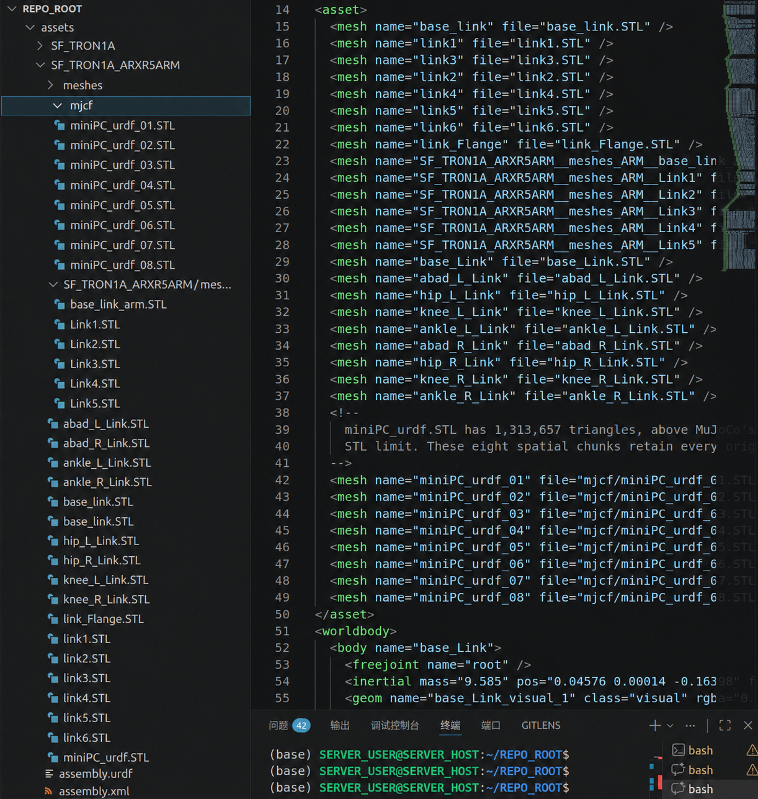
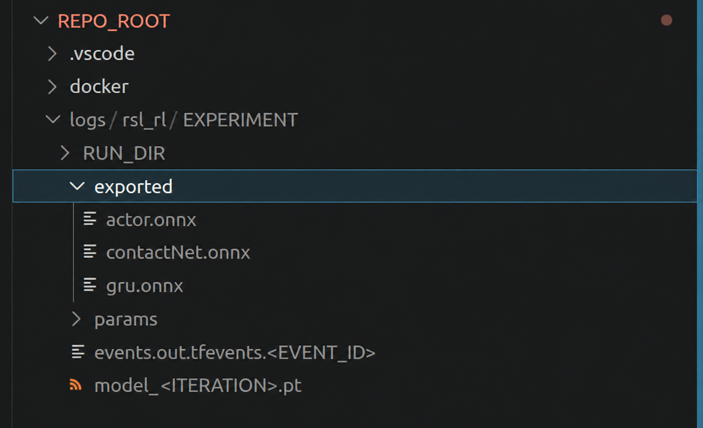

> [!warning] 经验与安全说明
> 本文部分结论与命令来自笔者在特定软硬件版本、项目代码和实验环境中的个人实践，仅供学习与方案参考，不保证适用于其他环境，也不构成法律、专业或安全建议。执行前请核对官方文档、备份数据，并独立评估权限、设备与实验风险。

> [!abstract] 本文以 Isaac Lab 到 MuJoCo 的 Sim2Sim 为例

## 什么是 Sim2Sim

> 对同一个已训练策略，在另一个仿真器中做推理闭环验证。

- 在本文的场景下，策略先在 Isaac Lab 训练，再放到 MuJoCo 环境里运行，观察稳定性、误差、鲁棒性和部署链路一致性。
- 它通常不做参数更新，属于评估与验证阶段，**不是继续训练阶段**。

### 需要的最小条件

1. Python 环境：之前配置的 `(isaaclab)` 虚拟环境，参见[基于 Ubuntu + RTX 50 系列的 Isaac Lab 仿真框架搭建指南](%E5%9F%BA%E4%BA%8EUbuntu%2BRTX50%E7%B3%BB%E5%88%97%E7%9A%84Isaac%20Lab%E4%BB%BF%E7%9C%9F%E6%A1%86%E6%9E%B6%E6%90%AD%E5%BB%BA%E6%8C%87%E5%8D%97.md#obsidian-block-17c297)。
2. 新安装包：`mujoco`、`onnxruntime`。
3. 策略文件：本项目导出的 actor、ContactNet、GRU 三个 ONNX 文件。
4. 机器人模型：MuJoCo 的 XML 与其引用的 meshes。
5. 可选任务输入：轨迹文件 PKL。
6. 与当前仓库版本匹配的 Sim2Sim 运行脚本。

### MuJoCo 依赖和文件定位

安装 MuJoCo 所需依赖：

```bash
conda activate isaaclab
pip install mujoco==3.2.2 onnxruntime
python -c "import mujoco, onnxruntime; print(mujoco.mj_version(), onnxruntime.__version__)"
```

- 将 Sim2Sim 脚本放在当前项目约定的 `scripts/sim2sim/` 目录中。
- 将机器人 XML 与 URDF、mesh 资产放在仓库约定的机器人资产目录中。
- 确认 XML 中引用的 mesh 名称、大小写和实际文件完全一致。

{width="357"}

> [!warning] 文件名大小写
> Linux 区分大小写，例如 `base_link.stl` 与 `base_Link.stl` 是两个不同文件。

## checkpoint 的 `.pt` 文件和 ONNX 文件的区别

- checkpoint（例如 `model_<ITERATION>.pt`）
  - 是训练框架保存的序列化存档。它至少可以包含模型参数，也可能同时包含优化器、归一化器、迭代计数或其他恢复训练所需的状态。
  - **具体包含哪些对象取决于保存代码，不能仅凭 `.pt` 后缀断定。**继续训练前应检查仓库的 `save` / `load` 实现和 checkpoint 键名。
- ONNX（本项目导出的 actor、ContactNet、GRU）
  - 是面向推理交换的计算图与参数格式，便于通过 ONNX Runtime 等后端跨框架执行。
  - 它通常不包含优化器等训练状态，也不保证文件一定比 checkpoint 更小。
  - 在本文项目中，它既用于 Sim2Sim，也与后续部署侧采用的推理格式保持一致。

> [!warning] 仓库版本依赖
> 以下导出文件名、目录和脚本参数来自一个特定仓库版本。其他版本可能导出单个或不同数量的 ONNX 文件，也可能由独立脚本完成导出；请以当前代码为准。

> [!abstract] `play.py` 串联 checkpoint 和 ONNX 导出
> 1. `play.py` 加载某个明确指定的 checkpoint 做推理。
> 2. 本项目的导出逻辑会在对应 run 目录中创建 `exported/`。
> 3. 当前实现导出 actor、ContactNet、GRU 三个 ONNX 文件。
>
> 
>
> 在这一版代码里，只有实际触发导出逻辑时 ONNX 才会更新：
>
> - 用新 checkpoint 重新导出，会得到与该 checkpoint 对应的新文件；若文件名相同，旧文件可能被覆盖。
> - 只继续训练而不重新导出，不会自动改变部署目录里的 ONNX。
> - 部署工作区是否更新，取决于是否把经过核验的新导出文件同步过去。

> [!question] 为什么 Sim2Sim 使用 ONNX 而不是 checkpoint？
> - 这里的目标是验证部署推理链路，ONNX 正好是本项目选用的推理交换格式。
> - MuJoCo 脚本通过 `onnxruntime` 加载模型，不需要启动完整训练框架。
> - 使用和部署侧一致的推理格式，有助于提前发现输入输出、归一化和模型导出方面的问题。
> - checkpoint 仍可用于框架内恢复或评估，但其可移植性取决于保存代码和运行环境。

## 命令脚本

> [!warning] 先核对变量
> 下面使用环境变量代替内部路径。执行前必须给它们赋值，并确认 XML、策略和轨迹均来自同一模型版本；不要把示例占位符直接粘贴到真实设备流程中。

```bash
# 先在当前 shell 中设置，例如：
# export PROJECT_ROOT="/path/to/project"
# export SIM2SIM_SCRIPT="/path/to/current/sim2sim_script.py"
# export MJCF_FILE="/path/to/robot.xml"
# export POLICY_DIR="/path/to/exported/policy"
# export TRAJECTORY_FILE="/path/to/trajectory.pkl"

: "${PROJECT_ROOT:?请先设置 PROJECT_ROOT}"
: "${SIM2SIM_SCRIPT:?请先设置 SIM2SIM_SCRIPT}"
: "${MJCF_FILE:?请先设置 MJCF_FILE}"
: "${POLICY_DIR:?请先设置 POLICY_DIR}"
: "${TRAJECTORY_FILE:?请先设置 TRAJECTORY_FILE}"

conda activate isaaclab
cd "${PROJECT_ROOT}"

# 可选：快速检查
python -c "import mujoco,onnxruntime; print(mujoco.mj_version(), onnxruntime.__version__)"

# A. Headless 版本（批量测试/日志记录）
python "${SIM2SIM_SCRIPT}" \
  --mjcf "${MJCF_FILE}" \
  --model-dir "${POLICY_DIR}" \
  --trajectory "${TRAJECTORY_FILE}" \
  --trajectory-index 0 \
  --trajectory-start-delay 3.0 \
  --duration 30 \
  --headless

# B. Viewer 版本（可视化观察；0 表示由当前脚本约定持续运行）
python "${SIM2SIM_SCRIPT}" \
  --mjcf "${MJCF_FILE}" \
  --model-dir "${POLICY_DIR}" \
  --trajectory "${TRAJECTORY_FILE}" \
  --trajectory-index 0 \
  --trajectory-start-delay 3.0 \
  --duration 0
```

- `--model-dir` 指向 ONNX 策略文件目录。本文对应的脚本要求 actor、ContactNet、GRU 三个文件同时存在；脚本只加载它们推理，不训练或更新参数。
- `--trajectory-index` 表示选择轨迹文件中的第几个 episode，`0` 是第一条。
- `--trajectory-start-delay` 表示开始输入轨迹前的等待时间，可用于让仿真初始状态先稳定；具体秒数需要结合任务判断。
- `--duration` 是仿真总时长。本文脚本约定 `0` 为不设上限，其他实现未必相同。
- 若想测试随机采样的影响，可在脚本支持时添加 `--sample-latent`。
- 若想复现实验，应固定 `--seed`，并同时记录模型、仿真器、资产和配置版本。

> [!important] 若不想让机器人跟随固定轨迹，可使用手动目标
> 请先确认当前脚本确实支持这些参数，再执行：
>
> ```bash
> python "${SIM2SIM_SCRIPT}" \
>   --mjcf "${MJCF_FILE}" \
>   --model-dir "${POLICY_DIR}" \
>   --duration 0
> ```
>
> 终端可能要求输入末端目标：`x y z roll pitch yaw`。位置单位与姿态单位必须以脚本实现为准；输入前还应检查工作空间、碰撞和坐标系约定。

> [!important] 若想通过键盘控制目标移动
> 请先在纯仿真环境中验证按键映射和步长：
>
> ```bash
> python "${SIM2SIM_SCRIPT}" \
>   --mjcf "${MJCF_FILE}" \
>   --model-dir "${POLICY_DIR}" \
>   --command 1 0 0 0 0 0 \
>   --command-frame world \
>   --keyboard-step 0.02 \
>   --duration 0
> ```
>
> 当前脚本的键盘映射：
>
> 1. W/S：前后。
> 2. A/D：左右。
> 3. R/F：上下。
> 4. P：打印当前目标坐标。
>
> 若要以机器人朝向定义前后左右，把 `--command-frame world` 改为 `--command-frame base`。这只是仿真侧命令，不应直接视作真机安全验证。
