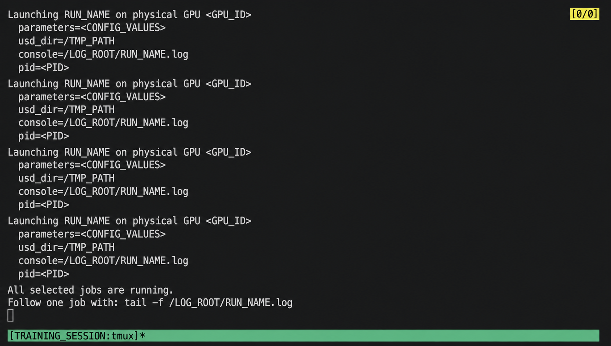
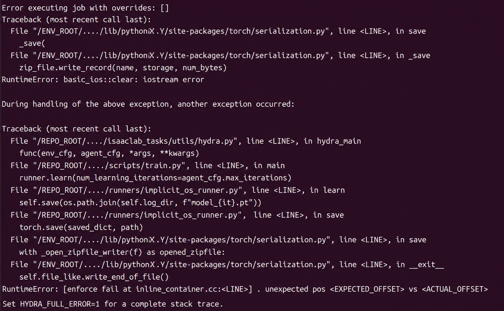
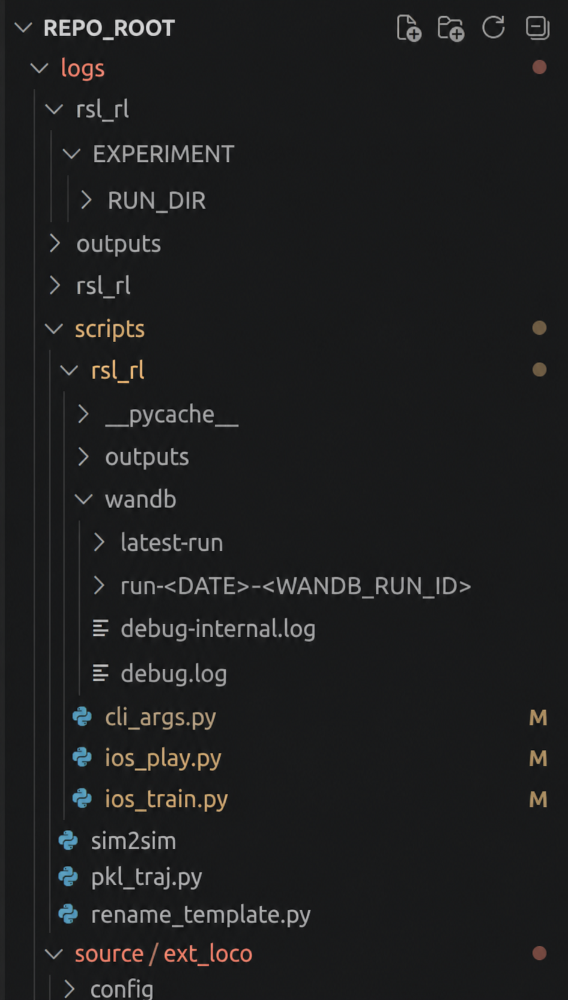

> [!warning] 经验与安全说明
> 本文部分结论与命令来自笔者在特定软硬件版本、项目代码和实验环境中的个人实践，仅供学习与方案参考，不保证适用于其他环境，也不构成法律、专业或安全建议。执行前请核对官方文档、备份数据，并独立评估权限、设备与实验风险。

> [!warning] 仓库与硬件强相关
> 本文的任务 ID、脚本名、Hydra 覆盖字段和日志层级都依赖当时使用的仓库版本。运行前请逐项对照当前源码；涉及多 GPU、删除缓存、恢复 checkpoint 或写入 W&B 的命令，必须先在副本和非关键任务上验证。

## 训练代码

### 本机训练

下面把本机目录和实验参数写成环境变量，避免把内部路径与 run 身份固化在笔记中：

```bash
# 请先在当前 shell 中设置：
# export CONDA_ENV="<CONDA_ENV>"
# export PROJECT_ROOT="/path/to/project"
# export TASK_ID="当前仓库注册的任务 ID"
# export RUN_NAME="本次公开可识别的 run 名称"
# export NUM_ENVS="按显存压力测试填写"
# export MAX_ITERATIONS="按实验计划填写"

: "${CONDA_ENV:?请先设置 CONDA_ENV}"
: "${PROJECT_ROOT:?请先设置 PROJECT_ROOT}"
: "${TASK_ID:?请先设置 TASK_ID}"
: "${RUN_NAME:?请先设置 RUN_NAME}"
: "${NUM_ENVS:?请先设置 NUM_ENVS}"
: "${MAX_ITERATIONS:?请先设置 MAX_ITERATIONS}"

conda activate "${CONDA_ENV}"
cd "${PROJECT_ROOT}/scripts/rsl_rl"

export PYTORCH_CUDA_ALLOC_CONF=expandable_segments:True
python ios_train.py \
  --headless \
  --task "${TASK_ID}" \
  --num_envs "${NUM_ENVS}" \
  --max_iterations "${MAX_ITERATIONS}" \
  --logger wandb \
  --run_name "${RUN_NAME}"
```

任务 ID 的可选值需要查看当前仓库相应任务配置目录中的 `__init__.py`。不同 commit 的注册名可能不同，不能照搬本文的历史值。

<a id="obsidian-block-c71a38"></a>

### 服务器多卡同时训练不同参数

多卡训练有两种常见做法：

- 打开多个终端，每个进程绑定一张 GPU，并传入各自的参数。
- 编写调度脚本，由一个终端为多张 GPU 启动相互独立的训练进程。

这两种做法都是“每张卡训练一个独立策略”，并不等于多卡共同训练同一个 policy。

#### 1. 多终端隔离（也可用于单卡服务器）

每张 GPU 可使用如下模板：

```bash
# 请先设置 PROJECT_ROOT、TASK_ID、RUN_NAME、NUM_ENVS、MAX_ITERATIONS、SEED、GPU_ID，
# 以及各个奖励权重变量。
: "${PROJECT_ROOT:?}"
: "${TASK_ID:?}"
: "${RUN_NAME:?}"
: "${NUM_ENVS:?}"
: "${MAX_ITERATIONS:?}"
: "${SEED:?}"
: "${GPU_ID:?}"
: "${POSITION_WEIGHT:?}"
: "${ORIENTATION_WEIGHT:?}"
: "${PB_WEIGHT:?}"
: "${REFERENCE_WEIGHT:?}"

conda activate isaaclab_umi_on_tron
cd "${PROJECT_ROOT}/scripts/rsl_rl"

export CUDA_VISIBLE_DEVICES="${GPU_ID}"
export WBC_LOG_ROOT="${PROJECT_ROOT}/logs/rsl_rl"
export PYTORCH_CUDA_ALLOC_CONF=expandable_segments:True

python ios_train.py \
  --headless \
  --device cuda:0 \
  --task "${TASK_ID}" \
  --run_name "${RUN_NAME}" \
  --seed "${SEED}" \
  --num_envs "${NUM_ENVS}" \
  --max_iterations "${MAX_ITERATIONS}" \
  --logger wandb \
  env.rewards.track_EE_position_exp.weight="${POSITION_WEIGHT}" \
  env.rewards.track_EE_orientation_exp.weight="${ORIENTATION_WEIGHT}" \
  env.rewards.track_EE_pb.weight="${PB_WEIGHT}" \
  env.rewards.track_EE_reference_exp.weight="${REFERENCE_WEIGHT}" \
  agent.wandb_run_name="${RUN_NAME}"
```

最后四项是 Hydra 对任务配置中对应奖励参数的命令行覆盖。这样可以保持配置文件不变，让不同进程采用不同参数。字段名必须以当前配置 schema 为准。

若不需要 Hydra 覆盖，可省略这些字段。若要从历史 checkpoint 恢复，则把 run 和 checkpoint 显式参数化：

```bash
: "${PROJECT_ROOT:?}"
: "${TASK_ID:?}"
: "${SOURCE_RUN:?}"
: "${CHECKPOINT_FILE:?}"
: "${NUM_ENVS:?}"
: "${MAX_ITERATIONS:?}"

cd "${PROJECT_ROOT}/scripts/rsl_rl"
export WBC_LOG_ROOT="${PROJECT_ROOT}/logs/rsl_rl"
export PYTORCH_CUDA_ALLOC_CONF=expandable_segments:True

python ios_train.py \
  --headless \
  --task "${TASK_ID}" \
  --num_envs "${NUM_ENVS}" \
  --max_iterations "${MAX_ITERATIONS}" \
  --logger wandb \
  --resume \
  --load_run "${SOURCE_RUN}" \
  --checkpoint "${CHECKPOINT_FILE}"
```

#### 2. 一键启动多组独立训练（Recommended）

可以在项目的 `scripts/rsl_rl/` 下编写类似 `launch_gpu_reward_sweep.sh` 的脚本，用于在一台多 GPU 主机上并行启动多组独立实验。每个进程应拥有：

- 独立的 Isaac Lab 仿真环境；
- 独立的 Actor/Critic、GRU、ContactNet 和优化器状态；
- 独立的 checkpoint、TensorBoard events、W&B run 和控制台日志；
- 独立的奖励权重。

如果目标是让多张卡共同训练同一个 policy，则需要当前训练框架明确支持的分布式方案，例如 `torchrun + NCCL + DDP`，并正确同步 PPO 统计、归一化状态和 checkpoint。不能把“启动多个独立进程”的脚本当成 DDP。

参数数组可按 GPU 索引组织：

```bash
# 下面仅展示结构；实际数值由实验计划给出。
position_weights=(    "${POSITION_WEIGHT_0}"    "${POSITION_WEIGHT_1}" )
orientation_weights=( "${ORIENTATION_WEIGHT_0}" "${ORIENTATION_WEIGHT_1}" )
pb_weights=(          "${PB_WEIGHT_0}"          "${PB_WEIGHT_1}" )
reference_weights=(   "${REFERENCE_WEIGHT_0}"   "${REFERENCE_WEIGHT_1}" )
```

数组下标对应调度脚本定义的物理 GPU 编号。没有被循环选中的 GPU 不会启动进程，其参数也不会被读取。

启动脚本前先检查可见设备、输出目录和恢复模式：

```bash
: "${PROJECT_ROOT:?}"
conda activate isaaclab_umi_on_tron
cd "${PROJECT_ROOT}/scripts/rsl_rl"

# 先阅读脚本，再运行；变量名以当前脚本实现为准。
RESUME=false ./launch_gpu_reward_sweep.sh
```

正常运行时可以查看各进程启动状态：



也可以查看控制台日志：

```bash
: "${LOG_FILE:?请把 LOG_FILE 设置为要查看的明确日志文件}"
tail -f -- "${LOG_FILE}"
```

> [!tip] 环境数量不要照搬
> `num_envs` 的可用值与显存、资产复杂度、观测、网络结构和渲染设置共同相关。先从较小值开始，用显存峰值和稳定性测试逐步上调，不能从一次服务器实测推出通用甜点值。

### 多卡共同恢复同一个 checkpoint

只有当前仓库的 DDP 恢复脚本明确实现了多卡同步时，才使用类似模板：

```bash
: "${PROJECT_ROOT:?}"
: "${GPU_IDS:?}"
: "${SAFETY_WEIGHT:?}"

conda activate isaaclab_umi_on_tron
cd "${PROJECT_ROOT}/scripts/rsl_rl"

GPU_IDS="${GPU_IDS}" \
SAFETY_WEIGHT="${SAFETY_WEIGHT}" \
PYTHON_BIN="$(command -v python)" \
./launch_multiple_gpu_ddp_resume.sh
```

## 训练中途的检查

### 可视化回放（新窗口，不中断 headless 训练进程）

```bash
# 请设置 PROJECT_ROOT、RUN_GROUP、TASK_ID。
: "${PROJECT_ROOT:?}"
: "${RUN_GROUP:?}"
: "${TASK_ID:?}"

LOG_ROOT="${PROJECT_ROOT}/logs/rsl_rl"
latest_run=$(ls -td -- "${LOG_ROOT}/${RUN_GROUP}"/* | head -n 1)
ckpt=$(ls "${latest_run}"/model_*.pt | sort -V | tail -n 1)

cd "${PROJECT_ROOT}"
python scripts/rsl_rl/ios_play.py \
  --task "${TASK_ID}" \
  --num_envs 1 \
  --load_run "$(basename "${latest_run}")" \
  --checkpoint "$(basename "${ckpt}")"
```

### 训练中途录制视频（headless）

在上一段已经确认 `latest_run` 和 `ckpt` 后：

```bash
: "${VIDEO_LENGTH:?请设置 VIDEO_LENGTH}"

cd "${PROJECT_ROOT}"
python scripts/rsl_rl/ios_play.py \
  --task "${TASK_ID}" \
  --headless \
  --video \
  --video_length "${VIDEO_LENGTH}" \
  --num_envs 1 \
  --load_run "$(basename "${latest_run}")" \
  --checkpoint "$(basename "${ckpt}")"
```

## 训练中断的检查与续训

| 报错关键词 | 可能含义 | 优先检查方向 |
| --- | --- | --- |
| `torch.save` / `write_record` / `iostream error` / `unexpected pos` | 写文件未完成 | 磁盘空间、inode、quota、权限、I/O 与文件系统状态 |
| `CUDA out of memory` / `backward()` | 显存不足 | 降低 `--num_envs` 或模型/缓冲区占用 |
| `No space left on device` | 空间或 inode 耗尽 | `df -h`、`df -i`、quota |
| `size mismatch` / `load_state_dict` | 模型维度不匹配 | checkpoint 与任务配置、网络结构是否一致 |

### OOM（Out of Memory）

先记录触发 OOM 时的任务配置和显存峰值，再逐步降低并行环境数量。若错误发生在 `backward()`，还要检查 batch、网络结构和训练缓冲区；不能只凭一条 OOM 日志断定唯一原因。

### 磁盘或 I/O 问题导致 checkpoint 写入失败

> [!example] 典型报错位置
> 
>
> ```text
> File ".../torch/serialization.py", line ..., in _save
>     zip_file.write_record(name, storage, num_bytes)
> RuntimeError: basic_ios::clear: iostream error
> ```
>
> 或：
>
> ```text
> RuntimeError: ... unexpected pos <ACTUAL_POSITION> vs <EXPECTED_POSITION>
> ```

如果崩溃点是 `save` / `torch.save` / `write_record`，而不是 `backward()`、`forward()` 或 `update()`，可以优先排查写文件链路。`iostream error` 和 `unexpected pos` 表明写入没有按预期完成，但**不能单凭这两条日志 100% 断定磁盘已满**；容量、inode、quota、权限、网络存储中断或磁盘 I/O 故障都可能造成类似结果。

#### 必须结合系统命令确认

```bash
: "${CHECK_PATH:?请设置为 checkpoint 所在文件系统中的明确目录}"
df -h -- "${CHECK_PATH}"
df -i -- "${CHECK_PATH}"

# 若系统启用了 quota，可再检查：
quota -s
```

只有在 `df`、inode 或 quota 输出支持时，才能把原因进一步确认为空间不足。否则应继续查看文件系统和内核日志。

#### 可选：检查最新文件尺寸

```bash
: "${CHECKPOINT_DIR:?请设置为一个明确的 run/checkpoint 目录}"
find "${CHECKPOINT_DIR}" -maxdepth 1 -type f -name 'model_*.pt' \
  -printf '%s %p\n' | sort -V | tail -n 8
```

同一保存逻辑产生的完整 checkpoint 通常尺寸接近。若最新文件明显偏小，这与“写入中断”一致，但仍应结合日志和实际加载测试判断。

#### 确认问题后的处理

> [!danger] 删除与清理前必须停下来核对
> 下面包含不可逆删除和缓存清理。先停止相关训练进程、备份 run 目录，使用 `ls -ld` / `du -sh` 检查每一个展开后的路径；不要以 `sudo` 执行，不要使用空变量，也不要把整个项目或主目录作为删除目标。

```bash
# 1. 先列出候选文件；确认损坏后，再把变量设为那个单一文件。
: "${CHECKPOINT_DIR:?}"
ls -lah -- "${CHECKPOINT_DIR}"/model_*.pt

: "${BROKEN_CHECKPOINT:?请显式设置为单个损坏 checkpoint}"
ls -l -- "${BROKEN_CHECKPOINT}"
rm -i -- "${BROKEN_CHECKPOINT}"

# 2. 可再生缓存：先查看，再逐个清理。
du -sh -- "${HOME}/.cache/pip" "${HOME}/.cache/ov" "${HOME}/.nv" 2>/dev/null
rm -rf -- "${HOME}/.cache/pip"
rm -rf -- "${HOME}/.cache/ov"
rm -rf -- "${HOME}/.nv"
conda clean -a -y

# 3. 再次确认空间。
df -h -- "${CHECKPOINT_DIR}"
df -i -- "${CHECKPOINT_DIR}"
```

从最后一个**经过加载验证的完整 checkpoint**恢复：

```bash
: "${PROJECT_ROOT:?}"
: "${TASK_ID:?}"
: "${SOURCE_RUN:?}"
: "${CHECKPOINT_FILE:?}"
: "${RUN_NAME:?}"
: "${NUM_ENVS:?}"
: "${MAX_ITERATIONS:?}"

cd "${PROJECT_ROOT}"
export PYTORCH_CUDA_ALLOC_CONF=expandable_segments:True

python scripts/rsl_rl/ios_train.py \
  --task "${TASK_ID}" \
  --num_envs "${NUM_ENVS}" \
  --max_iterations "${MAX_ITERATIONS}" \
  --resume \
  --load_run "${SOURCE_RUN}" \
  --checkpoint "${CHECKPOINT_FILE}" \
  --run_name "${RUN_NAME}" \
  --headless \
  --logger wandb
```

> [!tip]
> `run_name` 用于区分续训产生的新输出。不要仅凭“尺寸和相邻文件一样”认定 checkpoint 完整；恢复前至少尝试加载，并核对配置、迭代数和必要状态。

### 续训如何同时恢复 W&B 记录？

- 从 W&B 网页的 `<WANDB_RUN_URL>` 或本地 W&B 元数据中取得 `<WANDB_RUN_ID>`；网站副本不记录真实 URL、entity、project 或 run ID。
- 本地元数据目录的组织方式由 W&B 版本和当前仓库决定，可通过经过脱敏的界面示例辅助定位：

{width="194"}

- 获取 run ID 后，在续训命令之前设置：

```bash
: "${WANDB_RUN_ID:?请从自己的 W&B 项目中设置 WANDB_RUN_ID}"
export WANDB_RUN_ID
export WANDB_RESUME=must

# 然后运行已经核对过的续训命令。
```

> [!warning] W&B 写入目标
> `WANDB_RESUME=must` 会要求恢复现有 run。运行前核对 entity、project、权限和 run ID，避免把新实验写入错误记录；不要在公开日志中打印 API key。

## 与训练对应的推理代码

`play.py` 与 `train.py` 必须使用同一任务注册信息、观测与动作定义。使用参数化模板：

```bash
: "${PROJECT_ROOT:?}"
: "${PLAY_TASK_ID:?}"
: "${SOURCE_RUN:?}"
: "${CHECKPOINT_FILE:?}"

conda activate isaaclab
cd "${PROJECT_ROOT}"
python scripts/rsl_rl/ios_play.py \
  --task "${PLAY_TASK_ID}" \
  --num_envs 1 \
  --load_run "${SOURCE_RUN}" \
  --checkpoint "${CHECKPOINT_FILE}"
```

> [!warning] 工作目录依赖
> 这一版 `ios_play.py` 会根据当前工作目录拼接日志路径，因此要从项目根目录运行，而不是直接进入 `scripts/rsl_rl`。这个行为与仓库实现强相关；如果后续版本改用绝对配置路径，应以新代码为准。
