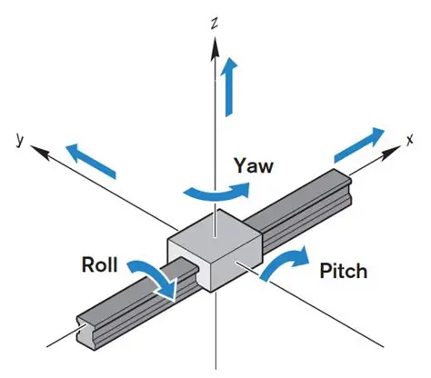
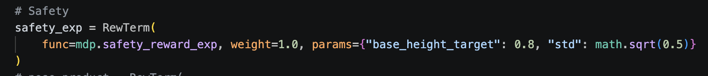
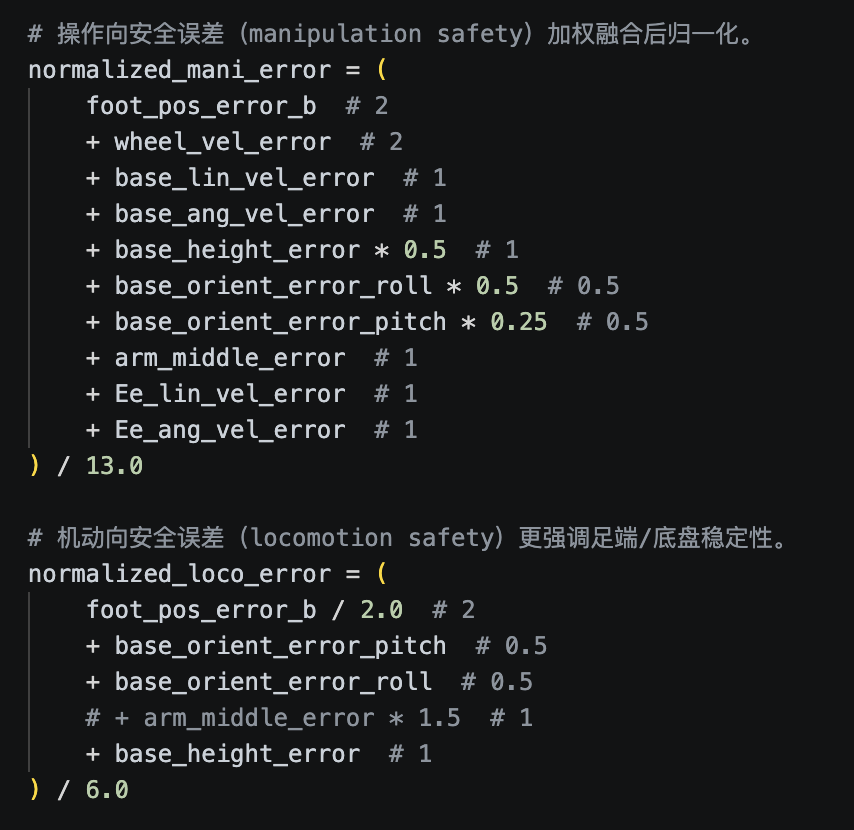
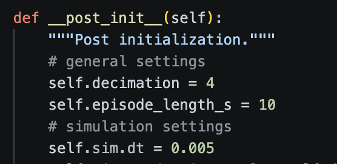

> [!warning] 阅读说明
> 本文是笔者基于特定课程、项目代码与个人学习过程整理的工作笔记。部分论断可能不完整、过时或依赖特定版本，请结合原始论文、官方文档及实际源码独立核验。

> [!iabstract] 参考项目
> 本笔记参考项目：[SPIRAL-EDWIN/JC_umi-on-tron](https://github.com/SPIRAL-EDWIN/JC_umi-on-tron)

本文侧重从奖励函数实现与奖励融合机制的角度拆解 RFM。若希望结合完整的训练部署链路与实际调参经验理解其工程落地，可对照阅读 [【组会分享】RFM/调参](RFM%20%26%20%E5%AE%9E%E9%99%85%E8%B0%83%E5%8F%82%E7%BB%8F%E9%AA%8C%E7%BB%84%E4%BC%9A%E5%88%86%E4%BA%AB.md)；两篇笔记分别对应机制分析与实践复盘，可以结合阅读。

## 说明
1. 本文件定义了 EE_pose 任务的奖励/惩罚函数（reward terms）。
2. 这些函数会在配置文件中的 RewardsCfg 里通过 RewTerm(func=...) 被调用并乘以对应权重。
3. 本文件只负责“计算每一项 reward 的原始值”，最终总奖励由 RewardManager 做加权求和。
4. 常见缩写:

    - EE: End-Effector，末端执行器
    - SE3: 位姿空间（位置 + 朝向）
        - 关于位姿：即位置+姿态，也就是所谓的“6 DoF”（六自由度） <a id="obsidian-block-ca108c"></a>
            - 位置即Position，是坐标系中(x,y,z)反映的平移
            - 姿态即旋转，是对状态更全面的定义（如果只有位置，就好比坐标系只定义了原点，但坐标系本身还是可以随便旋转）
                - 姿态描述的就是XYZ轴分别指向绝对空间的哪三个方向
                - 它通常由三个角度构成：如最常用的欧拉角（*Roll 翻滚角*、*Pitch 俯仰角*、*Yaw 偏航角*）

                  {width="193"}

    - `std`: 容忍尺度，数学公式中记作 $\sigma$；越小越严格（同样误差下 reward 会更低）

    - `_loco_mani_scale`: locomotion/manipulation混合因子，数学公式中记作 $L(t)$；$L\to0$ 偏mani，$L\to1$ 偏loco

5. 张量约定:
    - 第一维通常是并行环境数 num_envs
    - 函数返回 shape 一般为 `(num_envs,)`，表示每个并行env一个标量 reward

## 运行时三层关系
- 本任务在运行时可分为三层：
    1. 实现层：mdp目录中定义的每个函数如何计算
    2. 配置层：在 `env_cfg` 中声明actions、commands、rewards、curriculum等项
    3. 管理器层：由框架的 ActionManager、CommandManager、RewardManager、CurriculumManager、ObservationManager在每个env.step中按顺序调度执行

## 具体的Task确定具体的配置与 `RewardsCfg`
- 根据要训练的task（task的确定可以参考[仿真框架的初步学习](../../../OsdNotes/Embodied%20AI/%E4%BB%BF%E7%9C%9F%E6%A1%86%E6%9E%B6RFM%E7%9A%84%E5%88%9D%E6%AD%A5%E5%AD%A6%E4%B9%A0.md#obsidian-block-7ee914)显示的`__init__.py` 文件），可以得到对应的环境配置文件（通过查看`"env_cfg_entry_point": ...`）
    

- 进入例如 `sf_tron1_arm_env_cfg` 文件后，找到
```python
@configclass
class RewardsCfg:
	"""Reward terms for the MDP."""
```
这一块代码就是这个任务下奖励函数的配置层

> [!question]- `RewardsCfg` 和 `rewards.py` 的关系是什么
>  - `RewardsCfg` 是配置层，供RewardManager查看，决定该task要使用 `rewards.py` 中的**哪些奖励项**，每项**权重**多少，每项传哪些参数、哪些用默认值
>  - `rewards.py` 是实现层，**定义每个奖励项**具体怎么算（每个奖励项需要哪些参数，这些**参数的默认值定义**）
> 	 - 如 `safety_reward_exp` 的计算公式定义等
>
> 他们的关系可以写成：
>
> <span class="arithmatex arithmatex--display">&#92;&#91;R&#95;t&#61;&#92;sum&#95;&#123;i&#92;in&#92;mathcal I&#125;&#92;omega&#95;i r&#95;i&#40;t&#41;&#92;&#93;</span>
> 其中：
> - $r_i$ 来自 `rewards.py` ，是具体的奖励函数定义，包括env确定和传参需求确定
> - $\omega_i$ 和 $params_i$ 来自 `RewardsCfg`
>
> 例如对 `safety_reward_exp` 的理解：[【MDP】奖励函数解构学习](#obsidian-block-31a922)

## 本项目中的 **RFM (Reward Fusion Module, 奖励融合机制)**

> 这里需要和 `commands.py` 联动理解；并且该项目中的RFM和SUSTech的RFM有一些不同，注意区分

### 两个基础EE位姿误差：`position_error` ($e_{\mathrm{P}}$) & `orientation_error` ($e_{\mathrm{R}}$)

> 这两个误差不是由每个奖励函数重复计算的，而是由 `commands.py` 中的 `_update_metrics()` 在每个决策步统一更新，并存入 `metrics`，随后供各个奖励函数读取。

记世界坐标系下的target位姿为 $(\boldsymbol p_{\mathrm{target}}^{\mathrm W},\boldsymbol R_{\mathrm{target}}^{\mathrm W})$，当前EE位姿为 $(\boldsymbol p_{\mathrm{EE}}^{\mathrm W},\boldsymbol R_{\mathrm{EE}}^{\mathrm W})$。

#### 位置误差 `position_error` ($e_{\mathrm{P}}$)
- `position_error` 是target与当前EE之间的三维欧氏距离：

    <span class="arithmatex arithmatex--display">&#92;&#91;e&#95;&#123;&#92;mathrm&#123;P&#125;&#125;&#61;&#92;left&#92;&#124;&#92;boldsymbol p&#95;&#123;&#92;mathrm&#123;target&#125;&#125;&#94;&#123;&#92;mathrm W&#125;&#45;&#92;boldsymbol p&#95;&#123;&#92;mathrm&#123;EE&#125;&#125;&#94;&#123;&#92;mathrm W&#125;&#92;right&#92;&#124;&#95;2&#92;&#93;</span>

    - $e_{\mathrm{P}}\geq0$，单位为m

    - 它同时包含x、y、z三个方向的误差，只表示距离大小，不保留误差方向

    - $e_{\mathrm{P}}=0$ 表示EE的位置与target完全重合

#### 朝向误差 `orientation_error` ($e_{\mathrm{R}}$)
- `orientation_error` 是当前EE朝向与target朝向之间的最小相对旋转角。代码首先计算相对旋转矩阵：

    <span class="arithmatex arithmatex--display">&#92;&#91;&#92;boldsymbol R&#95;&#123;&#92;mathrm&#123;rel&#125;&#125;&#61;&#40;&#92;boldsymbol R&#95;&#123;&#92;mathrm&#123;target&#125;&#125;&#94;&#123;&#92;mathrm W&#125;&#41;&#94;&#123;&#92;mathrm T&#125;&#92;boldsymbol R&#95;&#123;&#92;mathrm&#123;EE&#125;&#125;&#94;&#123;&#92;mathrm W&#125;&#61;&#40;&#92;boldsymbol R&#95;&#123;&#92;mathrm&#123;target&#125;&#125;&#94;&#123;&#92;mathrm W&#125;&#41;&#94;&#123;&#45;1&#125;&#92;boldsymbol R&#95;&#123;&#92;mathrm&#123;EE&#125;&#125;&#94;&#123;&#92;mathrm W&#125;&#92;&#93;</span>

    - 直观上可以理解为两步：
        1. $(R_{\mathrm{target}}^{\mathrm W})^{-1}$：先消除target相对于世界坐标系的旋转；
        2. 再乘 $R_{\mathrm{EE}}^{\mathrm W}$：得到EE相对于target还差多少旋转。

- 再根据相对旋转矩阵的迹得到旋转角：

    <span class="arithmatex arithmatex--display">&#92;&#91;e&#95;&#123;&#92;mathrm&#123;R&#125;&#125;&#61;&#92;arccos&#92;left&#40;&#92;operatorname&#123;clamp&#125;&#92;left&#40;&#92;frac&#123;&#92;operatorname&#123;tr&#125;&#40;&#92;boldsymbol R&#95;&#123;&#92;mathrm&#123;rel&#125;&#125;&#41;&#45;1&#125;&#123;2&#125;&#44;&#45;1&#44;1&#92;right&#41;&#92;right&#41;&#92;&#93;</span>

    - $e_{\mathrm{R}}\in[0,\pi]$，单位为rad

    - 它表示两个frame之间总共相差多少角度，而不是分别计算Roll、Pitch、Yaw的差值

    - $e_{\mathrm{R}}=0$ 表示EE与target的朝向完全一致

> [!tip]- 朝向误差公式如何理解
> - 根据*欧拉旋转定理*，任意两个三维朝向之间的差异，都可以等效表示为：绕某一根旋转轴转过角度 $\theta$。这种表示方式称为**轴角表示（Axis–Angle Representation）**。
> - 相对旋转矩阵为：
> <span class="arithmatex arithmatex--display">&#92;&#91;&#92;boldsymbol R&#95;&#123;&#92;mathrm&#123;rel&#125;&#125;&#61;&#40;&#92;boldsymbol R&#95;&#123;&#92;mathrm&#123;target&#125;&#125;&#94;&#123;&#92;mathrm W&#125;&#41;&#94;&#123;&#92;mathrm T&#125; &#92;boldsymbol R&#95;&#123;&#92;mathrm&#123;EE&#125;&#125;&#94;&#123;&#92;mathrm W&#125;&#92;&#93;</span>
> 	- 它表示从target frame旋转到当前EE frame，还需要进行怎样的旋转
> 	- 若两个frame朝向完全相同，则 $\boldsymbol R_{\mathrm{rel}}=\boldsymbol I$
> - 对于三维旋转矩阵，其迹和旋转角满足：
> <span class="arithmatex arithmatex--display">&#92;&#91;&#92;operatorname&#123;tr&#125;&#40;&#92;boldsymbol R&#95;&#123;&#92;mathrm&#123;rel&#125;&#125;&#41;&#61;1&#43;2&#92;cos&#92;theta&#92;&#93;</span>
> 因此可以反推出两个frame之间的最短旋转角：
> <span class="arithmatex arithmatex--display">&#92;&#91;e&#95;&#123;&#92;mathrm&#123;R&#125;&#125;&#61;&#92;theta&#61;&#92;arccos&#92;left&#40;&#92;operatorname&#123;clamp&#125;&#92;left&#40; &#92;frac&#123;&#92;operatorname&#123;tr&#125;&#40;&#92;boldsymbol R&#95;&#123;&#92;mathrm&#123;rel&#125;&#125;&#41;&#45;1&#125;&#123;2&#125;&#44; &#45;1&#44;1 &#92;right&#41;&#92;right&#41;&#92;&#93;</span>
>
> 其中：
> - $\operatorname{tr}(\boldsymbol R_{\mathrm{rel}})$ 表示相对旋转矩阵主对角线三个元素之和
> - $\arccos$ 是余弦函数的反函数，用于根据 $\cos\theta$ 还原旋转角 $\theta$
> - `clamp(...,-1,1)` 用于避免浮点误差使输入略微超出 $\arccos$ 的有效范围 $[-1,1]$

> [!warning] 这里的EE pose对应配置项 `body_name` 指定的刚体坐标系，而不一定是夹爪TCP
> 本笔记只讨论 SF 配置。该配置使用 `body_name="eef_link"`，因此这里计算的是 `eef_link` frame 与 target 之间的位姿误差。

### 对 `safety_reward_exp` 安全奖励的理解
 <a id="obsidian-block-31a922"></a>

> “safety”：该奖励鼓励“安全姿态和安全运动”
> “exp”：把误差通过指数函数做成平滑、有界的奖励

- 在配置文件的 `RewardsCfg` 中，可以得到奖励函数对`safety_reward_exp`该项奖励的权重和参数分配：

    

    - 如图显示：权重weight=1.0；其中参数`base_height_target=0.8`，`std=sqrt(0.5)`而非默认值

- 对于`safety_reward_exp`函数本体，在 `rewards.py` 中：
    1. 这个函数先构造了两类*安全误差*：
        - manipulation safety error：操作安全
        - locomotion safety error：机动稳定
        {width="371"}
        safety error的本质是，误差越小越安全，误差越大越不稳定，也就越不安全
    2. 然后把上述两个安全误差（这里统称为 $E$ ）通过指数函数映射成原始安全尺度 $S$：

        <span class="arithmatex arithmatex--display">&#92;&#91;S&#61;&#92;exp&#92;left&#40;&#45;&#92;frac&#123;E&#125;&#123;&#92;sigma&#94;2&#125;&#92;right&#41;&#92;&#93;</span>

        直观理解：

        - $E=0$时，安全尺度为1（最好）
        - $E$变大时，安全尺度快速衰减到接近0
        - $\sigma$越小，衰减越快（越严格）

        - 将归一化后的manipulation safety error和locomotion safety error分别记作 $E_{\mathrm{mani}}(t)$ 和 $E_{\mathrm{loco}}(t)$，对应的原始安全尺度为：

            <span class="arithmatex arithmatex--display">&#92;&#91;S&#95;&#123;&#92;mathrm&#123;mani&#125;&#125;&#40;t&#41;&#61;&#92;exp&#92;left&#40;&#45;&#92;frac&#123;E&#95;&#123;&#92;mathrm&#123;mani&#125;&#125;&#40;t&#41;&#125;&#123;&#92;sigma&#94;2&#125;&#92;right&#41;&#44;&#92;qquad S&#95;&#123;&#92;mathrm&#123;loco&#125;&#125;&#40;t&#41;&#61;&#92;exp&#92;left&#40;&#45;&#92;frac&#123;E&#95;&#123;&#92;mathrm&#123;loco&#125;&#125;&#40;t&#41;&#125;&#123;&#92;sigma&#94;2&#125;&#92;right&#41;&#92;&#93;</span>

        - $S_{\mathrm{mani}}(t),S_{\mathrm{loco}}(t)\in(0,1]$；安全误差越小，对应的原始安全尺度越接近1

        - 代码传给其他reward使用的**缓存值**在原始安全尺度上增加了0.4：`_mani_safety_scale`对应$S_{\mathrm{mani}}(t)+0.4$，`_loco_safety_scale`对应$S_{\mathrm{loco}}(t)+0.4$
    3. `safety_reward_exp`本身使用原始安全尺度，并通过**阶段门控`_loco_mani_scale`($L$)** 加权计算：

        <span class="arithmatex arithmatex--display">&#92;&#91;r&#95;&#123;&#92;mathrm&#123;safety&#125;&#125;&#40;t&#41;&#61;S&#95;&#123;&#92;mathrm&#123;mani&#125;&#125;&#40;t&#41;&#92;cdot&#40;1&#45;L&#40;t&#41;&#41;&#43;S&#95;&#123;&#92;mathrm&#123;loco&#125;&#125;&#40;t&#41;&#92;cdot L&#40;t&#41;&#92;&#93;</span>

        - 从这个加权公式可以看出来：门控$L(t)\to1$时，奖励函数更看重loco（足/底盘的稳定性）；$L(t)\to0$时，奖励函数更看重mani（EE操作的安全性/稳定性）

> [!tip]- 为什么安全尺度缓存值需要增加0.4
> 如果其他task reward直接乘原始安全尺度$S$，当机器人当前状态较不安全、$S\to0$时，这些task reward也会接近0，使策略几乎无法继续获得位置追踪、姿态追踪和任务进展方面的学习信号。
>
> 因此，代码将传给其他reward的安全尺度设置为$S+0.4$，使其范围由$(0,1]$变为$(0.4,1.4]$：
> - $S+0.4<1$：当前状态安全性较差，抑制task reward
> - $S+0.4=1$：对应$S=0.6$，不改变task reward的原始大小
> - $S+0.4>1$：当前状态安全性较好，放大task reward
>
> 因而，$+0.4$使安全尺度成为一种**带下限的软调制（floored soft modulation）**：它仍然根据安全质量调节task reward，但不会在不安全状态下将task reward完全关闭。

#### 什么是 `_loco_mani_scale` : Phase-dependent Soft Gate ($L$)

> [!question]- 为什么在这里介绍 $L(t)$
> 本文在 `safety_reward_exp` 中首次引入阶段门控 $L(t)$，因此将其定义放在本节下。
> 需要注意，$L(t)$不参与 $S_{\mathrm{mani}}(t)$ 和 $S_{\mathrm{loco}}(t)$ 本身的计算，而是在二者计算完成后控制它们在 $r_{\mathrm{safety}}$ 中的融合比例。后续的 reference、position 和 orientation reward 也会复用同一个 $L(t)$。

> 这个参数是一个*按环境逐个计算*的动态权重，用来在locomotion相关奖励和manipulation相关奖励之间连续调整影响力，范围在 $[0,1]$
> 下划线前缀表示这是**内部状态缓存**，不是外部配置项

- 通俗理解：
    - 机器人在reset后，一开始 $D_{\mathrm{ref}}(t)$ 相对较大，$L(t)\to1$，系统偏向预期locomotion阶段；随着 $D_{\mathrm{ref}}(t)$ 下降，$L(t)$ 逐渐减小并转向预期manipulation阶段
    - 随着时间的推移，机器人**被预期**逐渐由locomotion主导变为manipulation主导，$L$逐步变小，系统更偏向EE的精细控制

##### $L$ 如何得出
1. **在 `commands.py`里先初始化`se3_distance_ref` 和 `_loco_mani_scale`**
    - `self.se3_distance_ref = torch.ones(self.num_envs, device=self.device) * 5.0         # 即先给默认值5.0`
    - `self._env._loco_mani_scale = torch.ones(self.num_envs, device=self.device)               # 先给默认值1.0`
    - 下文将代码变量`se3_distance_ref`记作$D_{\mathrm{ref}}(t)$；它表示预期的复合位姿误差，而不是严格的物理距离

2. **每决策步更新误差`metrics`，并让 $D_{\mathrm{ref}}(t)$ 按照 `decrease_vel`（记作$v_{\mathrm{dec}}$）递减**
    - 两次resample之间，$v_{\mathrm{dec}}$保持不变
    - $D_{\mathrm{ref}}(t+\Delta t)=\max\left(D_{\mathrm{ref}}(t)-v_{\mathrm{dec}}\cdot\Delta t,\ 0\right)$，其中$\Delta t=step\_dt$（决策步）

3. **用sigmoid函数将 $D_{\mathrm{ref}}(t)$ 映射成阶段门控 $L(t)$**

    <span class="arithmatex arithmatex--display">&#92;&#91;L&#40;t&#41;&#61;&#92;operatorname&#123;sigmoid&#125;&#92;left&#40;&#92;frac&#123;5&#125;&#123;&#92;mathrm&#123;decay&#92;&#95;length&#125;&#125;&#92;left&#40;D&#95;&#123;&#92;mathrm&#123;ref&#125;&#125;&#40;t&#41;&#45;&#92;mu&#95;L&#92;right&#41;&#92;right&#41;&#92;&#93;</span>

    - *目前实际调用的参数是$\mu_L=1.0$, $\mathrm{decay\_length}=1.0$*

> [!abstract]- sigmoid函数如何理解
> sigmoid函数将任意实数$z\in(-\infty,+\infty)$平滑映射到$(0,1)$：
> <span class="arithmatex arithmatex--display">&#92;&#91;&#92;operatorname&#123;sigmoid&#125;&#40;z&#41;&#61;&#92;frac&#123;1&#125;&#123;1&#43;&#92;exp&#40;&#45;z&#41;&#125;&#92;&#93;</span>
> 它具有以下性质：
> - $z=0$时，$\operatorname{sigmoid}(z)=0.5$
> - $z\gg0$时，$\operatorname{sigmoid}(z)\to1$
> - $z\ll0$时，$\operatorname{sigmoid}(z)\to0$
> - 函数连续且单调递增，因此可以在两个阶段之间进行平滑切换，而不是突然从0跳变到1
>
> 在阶段门控$L(t)$中：
> <span class="arithmatex arithmatex--display">&#92;&#91;z&#61;&#92;frac&#123;5&#125;&#123;&#92;mathrm&#123;decay&#92;&#95;length&#125;&#125;&#92;left&#40;D&#95;&#123;&#92;mathrm&#123;ref&#125;&#125;&#40;t&#41;&#45;&#92;mu&#95;L&#92;right&#41;&#92;&#93;</span>
> 因此：
> - $D_{\mathrm{ref}}(t)=\mu_L$时，$L(t)=0.5$，处于loco与mani的过渡中心
> - $D_{\mathrm{ref}}(t)>\mu_L$时，$L(t)\to1$，更偏向locomotion
> - $D_{\mathrm{ref}}(t)<\mu_L$时，$L(t)\to0$，更偏向manipulation
> - `decay_length`控制过渡区间的宽度：越小切换越陡，越大切换越平缓

4. **当reset、命令到期或命令管理器策略触发resample时，重新初始化 $D_{\mathrm{ref}}(t)$：**

    <span class="arithmatex arithmatex--display">&#92;&#91;D&#95;&#123;&#92;mathrm&#123;ref&#125;&#125;&#40;0&#41;&#61;2e&#95;&#123;&#92;mathrm&#123;P&#125;&#125;&#40;0&#41;&#43;e&#95;&#123;&#92;mathrm&#123;R&#125;&#125;&#40;0&#41;&#92;&#93;</span>

    - 这里的 $t=0$ 表示本次command开始后的局部时间原点，而不是episode的全局起点

    - **并且在$[0.5,1.4]$中重新随机采样$v_{\mathrm{dec}}$**

> [!warning] 注意，这里的$2e_{\mathrm{P}}+e_{\mathrm{R}}$ 是人为构造的复合指标，直接混合了 m 与 rad，不是严格具有单一物理单位的 SE(3) 距离

> [!tip] resample是给某些环境重新抽样一个新的命令目标(位置/姿态)并重置相关计时和参考量的过程，由 `commands.py` 实现

> 总的来说，就$L(t)$的计算而言，实际误差$e_{\mathrm{P}},e_{\mathrm{R}}$只在resample时用于初始化$D_{\mathrm{ref}}$
> 两次resample之间，`commands.py`中的`_update_metrics()`按照固定的$v_{\mathrm{dec}}$递减$D_{\mathrm{ref}}$，再通过sigmoid映射得到$L(t)$

> [!warning]- `commands.py` 在整个流程中的作用
> 1. 生成EE目标命令
> 2. 读取env当前机器人状态并计算误差
> 3. 维护 `se3_distance_ref`
> 4. 把 `se3_distance_ref` 通过 sigmoid 变成 `_loco_mani_scale`
> 5. 把这个门控系数交给 `rewards.py`用于混合locomotion与manipulation的奖励权重

### 【Locomotion_reward】对`track_EE_reference_exp` 的理解
前面定义的$D_{\mathrm{ref}}(t)$表示预期的复合位姿误差；实际复合位姿误差表示为$D_{\mathrm{actual}}(t)=2e_{\mathrm{P}}(t)+e_{\mathrm{R}}(t)$

- 二者的误差记作：

    <span class="arithmatex arithmatex--display">&#92;&#91;&#92;varepsilon&#95;&#123;&#92;mathrm&#123;ref&#125;&#125;&#40;t&#41;&#61;&#92;left&#92;lvert D&#95;&#123;&#92;mathrm&#123;ref&#125;&#125;&#40;t&#41;&#45;D&#95;&#123;&#92;mathrm&#123;actual&#125;&#125;&#40;t&#41; &#92;right&#92;rvert&#92;&#93;</span>

    - $\varepsilon_{\mathrm{ref}}$用来度量实际复合位姿误差是否按照预设的线性下降日程减小

- **核心计算公式**：

    <span class="arithmatex arithmatex--display">&#92;&#91;r&#95;&#123;&#92;mathrm&#123;reference&#125;&#125;&#40;t&#41; &#61; &#92;exp&#92;left&#40; &#45;&#92;frac&#123;&#92;overbrace&#123;&#92;max&#92;&#123;&#92;varepsilon&#95;&#123;&#92;mathrm&#123;ref&#125;&#125;&#40;t&#41;&#45;0&#46;5&#44; 0&#92;&#125;&#125;&#94;&#123;&#92;mathclap&#123;&#92;text&#123;Dead zone&#58; &#125;&#92;varepsilon&#95;&#123;&#92;mathrm&#123;ref&#125;&#125;&#40;t&#41;&#92;leq0&#46;5&#125;&#125;&#125;&#123;&#92;sigma&#94;2&#125; &#92;right&#41; &#92;cdot L&#40;t&#41; &#92;cdot &#92;underbrace&#123;&#40;S&#95;&#123;&#92;mathrm&#123;loco&#125;&#125;&#40;t&#41;&#43;0&#46;4&#41;&#125;&#95;&#123;&#92;mathclap&#123;&#92;text&#123;Locomotion safety gating&#125;&#125;&#125;&#92;&#93;</span>

    - 这里$\max\{\varepsilon_{\mathrm{ref}}(t)-0.5, 0\}$给了一个容忍误差区间：只要实际误差和预期误差相差不超过0.5，指数项为1，表示这一指数核给最大奖励

    - $L(t)$ 项让$r_{\mathrm{reference}}(t)$这一个奖励在预期的locomotion阶段才发挥效用，随着时间的推移，预期进入精确操作阶段之后，$L(t) \rightarrow 0$，`track_EE_reference_exp`几乎不影响manipulation阶段的策略训练

    - $(S_{\mathrm{loco}}(t)+0.4)$即前面提到的对原始locomotion安全尺度的软调制：除了实际误差和预期误差的差距尽可能小这一奖励因素之外，机器人本身在locomotion阶段的base稳定性等安全指标也必须被考虑，让$r_{\mathrm{reference}}(t)$ 在安全性较差时被削弱、安全性较好时被增强（这是为了遏制机器人为了达成预期要求而采取极端不安全的方式，让策略更倾向于稳定安全的前提来训练）
<a id="loco-manipulationtrack_ee_pb-progress-based"></a>

### 【Loco-manipulation_reward】对`track_EE_pb` 的理解（Progress-Based）
- $G_{\mathrm{walk}}$根据实时位置误差平滑区分远距离行走与近目标微调：

    <span class="arithmatex arithmatex--display">&#92;&#91;G&#95;&#123;&#92;mathrm&#123;walk&#125;&#125;&#40;t&#41;&#61;&#92;operatorname&#123;sigmoid&#125;&#92;left&#40;&#92;frac&#123;5&#125;&#123;0&#46;25&#125;&#92;left&#40;e&#95;&#123;&#92;mathrm&#123;P&#125;&#125;&#40;t&#41;&#45;0&#46;5&#92;right&#41;&#92;right&#41;&#61;&#92;operatorname&#123;sigmoid&#125;&#92;left&#40;20&#92;left&#40;e&#95;&#123;&#92;mathrm&#123;P&#125;&#125;&#40;t&#41;&#45;0&#46;5&#92;right&#41;&#92;right&#41;&#92;&#93;</span>

    - 不同于**由时间决定的预期**的 $L(t)$，$G_{\mathrm{walk}}(t)$ 是**由实时位置误差 $e_{\mathrm{P}}(t)$ 决定**的实际距离门控

- 每次resample时，$b_{\mathrm{P}}(t_r)=e_{\mathrm{P}}(t_r), \qquad b_{\mathrm{R}}(t_r)=e_{\mathrm{R}}(t_r)$
    - 其中 $t_r$ 表示本次command发生resample的时刻

- 记$b_{\mathrm{P}}(t-1)$和$b_{\mathrm{R}}(t-1)$为当前决策步之前记录到的历史最小位置误差和朝向误差，则本步产生的非负进步量为：

    <span class="arithmatex arithmatex--display">&#92;&#91;&#92;Delta e&#95;&#123;&#92;mathrm&#123;P&#125;&#125;&#40;t&#41;&#61;&#92;max&#92;&#123;b&#95;&#123;&#92;mathrm&#123;P&#125;&#125;&#40;t&#45;1&#41;&#45;e&#95;&#123;&#92;mathrm&#123;P&#125;&#125;&#40;t&#41;&#44;0&#92;&#125;&#44;&#92;qquad &#92;Delta e&#95;&#123;&#92;mathrm&#123;R&#125;&#125;&#40;t&#41;&#61;&#92;max&#92;&#123;b&#95;&#123;&#92;mathrm&#123;R&#125;&#125;&#40;t&#45;1&#41;&#45;e&#95;&#123;&#92;mathrm&#123;R&#125;&#125;&#40;t&#41;&#44;0&#92;&#125;&#92;&#93;</span>

- 计算进步量后，历史最优误差更新为：

    <span class="arithmatex arithmatex--display">&#92;&#91;b&#95;&#123;&#92;mathrm&#123;P&#125;&#125;&#40;t&#41;&#61;&#92;min&#92;&#123;b&#95;&#123;&#92;mathrm&#123;P&#125;&#125;&#40;t&#45;1&#41;&#44;e&#95;&#123;&#92;mathrm&#123;P&#125;&#125;&#40;t&#41;&#92;&#125;&#44;&#92;qquad b&#95;&#123;&#92;mathrm&#123;R&#125;&#125;&#40;t&#41;&#61;&#92;min&#92;&#123;b&#95;&#123;&#92;mathrm&#123;R&#125;&#125;&#40;t&#45;1&#41;&#44;e&#95;&#123;&#92;mathrm&#123;R&#125;&#125;&#40;t&#41;&#92;&#125;&#92;&#93;</span>

- 定义$G_{\mathrm{progress}}(t)=0.25+0.75G_{\mathrm{walk}}(t)$，使PB奖励在近目标阶段仍保留25%：

    <span class="arithmatex arithmatex--display">&#92;&#91;r&#95;&#123;&#92;mathrm&#123;pb&#125;&#125;&#40;t&#41; &#61; &#92;left&#40; 2 &#92;cdot &#92;Delta e&#95;&#123;&#92;mathrm&#123;P&#125;&#125;&#40;t&#41; &#92;cdot &#92;underbrace&#123;&#92;exp&#92;left&#40; &#45;&#92;frac&#123;b&#95;&#123;&#92;mathrm&#123;P&#125;&#125;&#40;t&#41;&#125;&#123;0&#46;5&#125; &#92;right&#41;&#125;&#95;&#123;&#92;text&#123;Position best&#45;error scaling&#125;&#125; &#43; &#92;Delta e&#95;&#123;&#92;mathrm&#123;R&#125;&#125;&#40;t&#41; &#92;cdot &#92;underbrace&#123;&#92;exp&#92;left&#40; &#45;&#92;frac&#123;b&#95;&#123;&#92;mathrm&#123;R&#125;&#125;&#40;t&#41;&#125;&#123;0&#46;5&#125; &#92;right&#41;&#125;&#95;&#123;&#92;text&#123;Orientation best&#45;error scaling&#125;&#125; &#92;right&#41; &#92;cdot &#40;S&#95;&#123;&#92;mathrm&#123;loco&#125;&#125;&#40;t&#41;&#43;0&#46;4&#41; &#92;cdot &#92;underbrace&#123;&#40;0&#46;25&#43;0&#46;75G&#95;&#123;&#92;mathrm&#123;walk&#125;&#125;&#40;t&#41;&#41;&#125;&#95;&#123;G&#95;&#123;&#92;mathrm&#123;progress&#125;&#125;&#40;t&#41;&#125;&#92;&#93;</span>

    - $\Delta e_{\mathrm{P}}(t)$ 和$\Delta e_{\mathrm{R}}(t)$ 即对进步量的奖励

    - 当历史最小位置误差已经很小的时候，$\exp\left( -\frac{b_{\mathrm P}(t)}{0.5} \right)$ 和 $\exp\left( -\frac{b_{\mathrm R}(t)}{0.5} \right)$ 这两个scale更接近1，会**保留更多**“误差进一步缩小”所产生的进步奖励；当历史最优误差仍较大时，它们会对进步量进行更强的衰减。

    - 这一项奖励使用$(0.25+0.75G_{\mathrm{walk}}(t))$ 而不使用$L(t)$ 是为了根据实时位置误差调节PB强度：==机器人逐渐靠近target的过程中，$r_{\mathrm{pb}}(t)$ 在 manipulation 阶段对总奖励的影响被削弱==
        - 远目标：$G_{\mathrm{walk}}\to1$，所以 $G_{\mathrm{progress}}\to1$；
        - 近目标：$G_{\mathrm{walk}}\to0$，所以 $G_{\mathrm{progress}}\to0.25$；
        - $e_{\mathrm{P}}=0.5$ 时：$G_{\mathrm{progress}}=0.625$

> [!tip] 其实 $(0.25+0.75G_{\mathrm{walk}}(t))$ 这一项，最初的公式代码没有
> 其实最初没有这一项的版本很好理解：
> $\left(2 \cdot \Delta e_{\mathrm{P}}(t) \cdot \exp \left(-\frac{b_{\mathrm{P}}(t)}{0.5} \right) + \Delta e_{\mathrm{R}}(t) \cdot \exp \left(-\frac{b_{\mathrm{R}}(t)}{0.5} \right) \right)$ 本身就趋向于奖励保留近目标时期的进步，但是$(0.25+0.75G_{\mathrm{walk}}(t))$ 的这一项又是遏制近目标进步的影响，所以二者似乎有些矛盾？$(0.25+0.75G_{\mathrm{walk}}(t))$ 的意义是什么？
>
> 见[Gprogress的意义](Gprogress%E7%9A%84%E6%84%8F%E4%B9%89.md)

### 【Manipulation_reward】对 `track_EE_position_exp` 的理解
$$
r_{\mathrm{P}}(t) = \left( \underbrace{\exp\left( -\frac{e_{\mathrm{P}}(t)}{\sigma^2} \right)}_{\text{Broad-range position tracking}} + \underbrace{\exp\left( -\frac{5 \cdot e_{\mathrm{P}}(t)}{\sigma^2} \right)}_{\text{Near-target precision enhancement}} \right) \cdot (1-L(t)) \cdot (S_{\mathrm{mani}}(t)+0.4)
$$

- $\left( \exp \left( -\frac{e_{\mathrm{P}}(t)}{\sigma^2} \right) + \exp\left( -\frac{5 \cdot e_{\mathrm{P}}(t)}{\sigma^2} \right) \right)$ 即对 $e_{\mathrm{P}}(t)$ 减小的奖励，$e_{\mathrm{P}}(t)$ 越小，该指数函数越大（$\to 1$）：
    - 值得注意的是，$\exp\left( -\frac{5 \cdot e_{\mathrm{P}}(t)}{\sigma^2} \right)$ 这一项通过系数 $5$ 使第二个指数核衰减更快，因此它只在位置误差非常小时显著增大，用于强化策略对近零定位精度的偏好

- $1-L(t)$ 这一项同 $r_{\mathrm{reference}}(t)$ 公式中的$L(t)$，即阶段门控，只不过这里是manipulation阶段才保留这一奖励
- $(S_{\mathrm{mani}}(t)+0.4)$ 这一项同上面出现的 $(S_{\mathrm{loco}}(t)+0.4)$，不过是对manipulation阶段原始安全尺度的软调制：
    - 事实上结合具体代码可以看出，$(S_{\mathrm{loco}}(t)+0.4)$ 只考虑了base的orientation（roll/pitch 稳定性）、height的限制以及foot_pose_error（足端 XY 偏移），是对locomotion过程中安全稳定的考量；
    - 而 $(S_{\mathrm{mani}}(t)+0.4)$ 在包含 $(S_{\mathrm{loco}}(t)+0.4)$ 这三个因素的基础上还考虑了base的线/角速度error（为了防止机器人身体在近目标阶段还和locomotion一样快速移动，“猛冲”过头）、EE的线/角速度（为了防止EE动作过大）、foot线速度、机械臂偏移等因素；
    **因此，$(S_{\mathrm{mani}}(t)+0.4)$ 确保的是在机器人在全身任务视角下，近目标的时的稳定安全性，这种相对更静态的状态比locomotion阶段对安全的要求更加复杂。**

> [!warning] 但是两个安全尺度不是完全的包含关系
> $E_{\mathrm{mani}}$ 不是简单地在 $E_{\mathrm{loco}}$ 原样基础上增加几项，因为共同误差在两者中的**系数**和**归一化**也不同

### 【Manipulation_reward】对`track_EE_orientation_exp` 的理解
$$
r_{\mathrm{R}}(t) = \left( \underbrace{\exp\left( -\frac{e_{\mathrm{R}}(t)}{\sigma^2} \right)}_{\text{Broad-range orientation tracking}} + \underbrace{\exp\left( -\frac{5 \cdot e_{\mathrm{R}}(t)}{\sigma^2} \right)}_{\text{Orientation precision enhancement}} \right) \cdot \underbrace{\exp\left( -\frac{e_{\mathrm{P}}(t)}{0.5} \right)}_{\text{Position-priority gating}} \cdot (1-L(t)) \cdot (S_{\mathrm{mani}}(t)+0.4)
$$

- $\left( \exp \left( -\frac{e_{\mathrm{R}}(t)}{\sigma^2} \right) + \exp\left( -\frac{5 \cdot e_{\mathrm{R}}(t)}{\sigma^2} \right) \right)$ 和$(1-L(t))$这两项同上，保证manipulation阶段该项奖励对任意误差都能敏感映射
- 值得注意的是 $\exp\left( -\frac{e_{\mathrm{P}}(t)}{0.5} \right)$ 这个 Position-based gate，它在orientation的奖励中增加了对 $e_{\mathrm{P}}(t)$ 的考量：
    - 这个gate的作用是在 EE 距离较远时强烈抑制 orientation reward，并随着位置误差减小逐渐释放该奖励
    - 这意味着 $r_{\mathrm R}(t)$ 这个奖励同时要在EE已经足够接近target的前提下才会逐渐介入影响，如果机器人离target还很远，那么就“先不急着调整EE的姿态”，而是要等足够接近再调整，这样最高效，各阶段的划分也更清晰

> [!warning] 版本与调度顺序
> 以下 step 顺序与具体仓库代码、提交版本和管理器调度实现强相关，不能视为 Isaac Lab 或 MDP 的通用不变量；正文保留为当时项目代码的阅读记录。

## `rewards.py`在整个MDP中的流程
- 首先，根据[仿真框架的初步学习](../../../OsdNotes/Embodied%20AI/%E4%BB%BF%E7%9C%9F%E6%A1%86%E6%9E%B6RFM%E7%9A%84%E5%88%9D%E6%AD%A5%E5%AD%A6%E4%B9%A0.md#obsidian-block-05009e) 可以在 `sf_tron1_arm_env_cfg.py` 这样的**环境配置文件**中，定义了仿真环境中的“*底层物理时间步*”，也叫“*仿真步*”(`sim.step`) 和大脑睁眼看世界的“*决策步*” (`env.step`)
    - 根据图中可以得出每一个 `sim.step` 是 `sim_dt=0.005` 秒，也就是物理世界每0.005秒更新一次；而每一个 `env.step` 由*decimation（降采样率）* 和 `sim.step` 共同决定，是 `step_dt = 4 * 0.005 = 0.02` 秒，也就是大脑每0.02s睁眼看一次世界并给一次action
    

1. 在上一个 `env.step` 结束的瞬间，`observations.py` 观测env计算得到参数字典$obs_k$，打包成一个tuple发送给Policy（神经网络），policy根据PPO算法返回对应的action $a_k$
2. 在该 `env.step` 这个0.02s内: $[t_k,t_k+0.02)$，$a_k$ 连续作用在其中的4个物理步
3. 在时刻$t_k+0.02$，`terminations.py` 终止管理器会判定哪些envs中的机器人出现了问题（done，time_out）等，给这些envs打上reset标记
4. 同一时刻，`rewards.py` 奖励管理器会计算这个0.02s内的奖励$reward_k$
    - 注意⚠️，奖励函数不考虑robot在0.02s内是否要reset，它只对reset前的状态打分

5. 对有reset标记的envs进行重置resample
6. `commands.py` 命令管理器执行 `compute(step_dt)`，内部状态被向前推进 `step_dt` 秒
    - 与此同时，`commands.py` 还会更新内部状态：计算误差、`se3_distance_ref`、`_loco_mani_scale`等
        - 如何得到`_loco_mani_scale`：命令管理器调用 **`_update_metrics()`** 功能，输入 `se3_distance_ref` 计算得到。用于下一轮$[t_k+0.02,t_k+0.04)$末的reward计算

7. 然后 `observations.py` 获取当前envs的各个状态参数$obs_{k+1}$，包括外部状态和已更新的内部状态（仅被注册为观测项的部分，如 `EE_se3_distance_reference = ObsTerm(func=mdp.EE_se3_distance_ref)`，这就表明`se3_distance_ref`会被Observation获取并提供给policy），用于下一轮提交给policy，生成下一个决策步的$a_{k+1}$，以此循环往复
