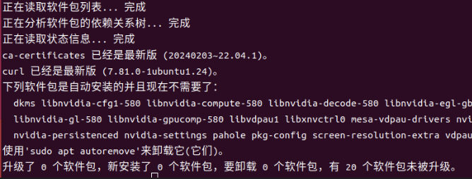
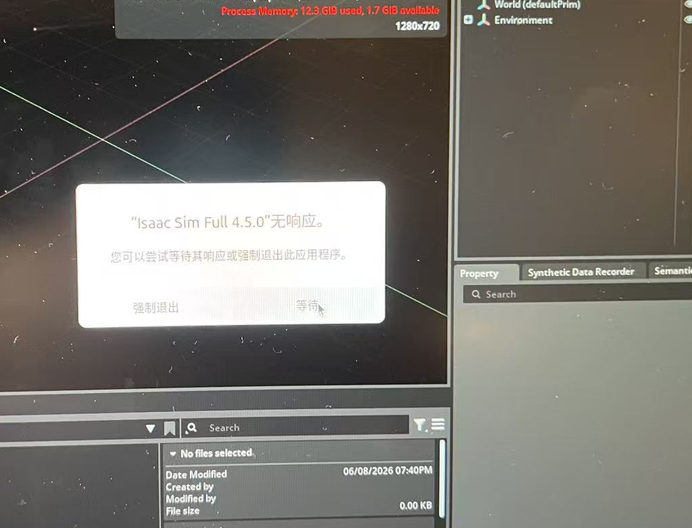
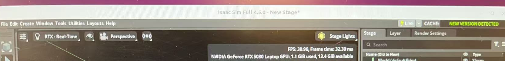
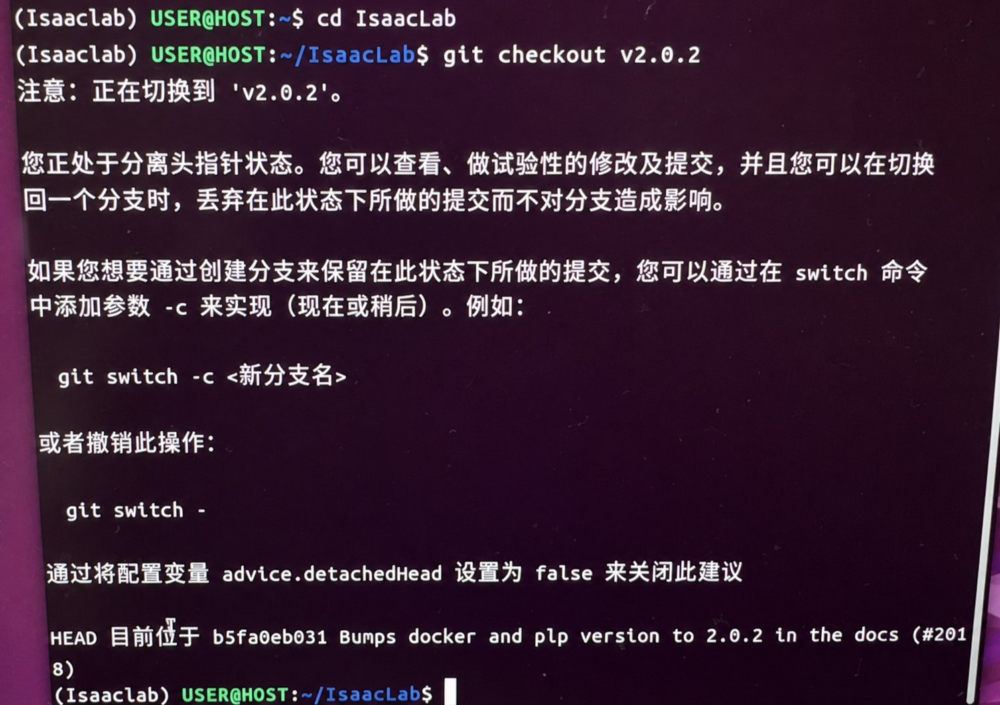
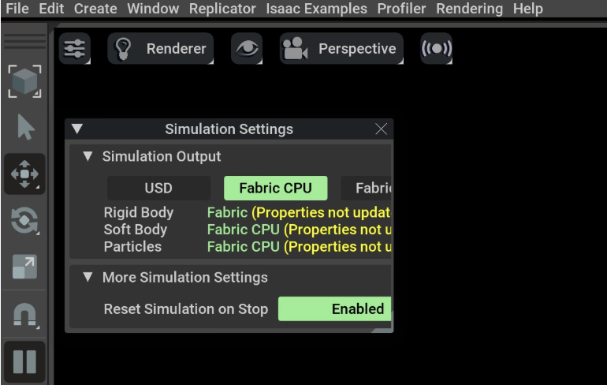
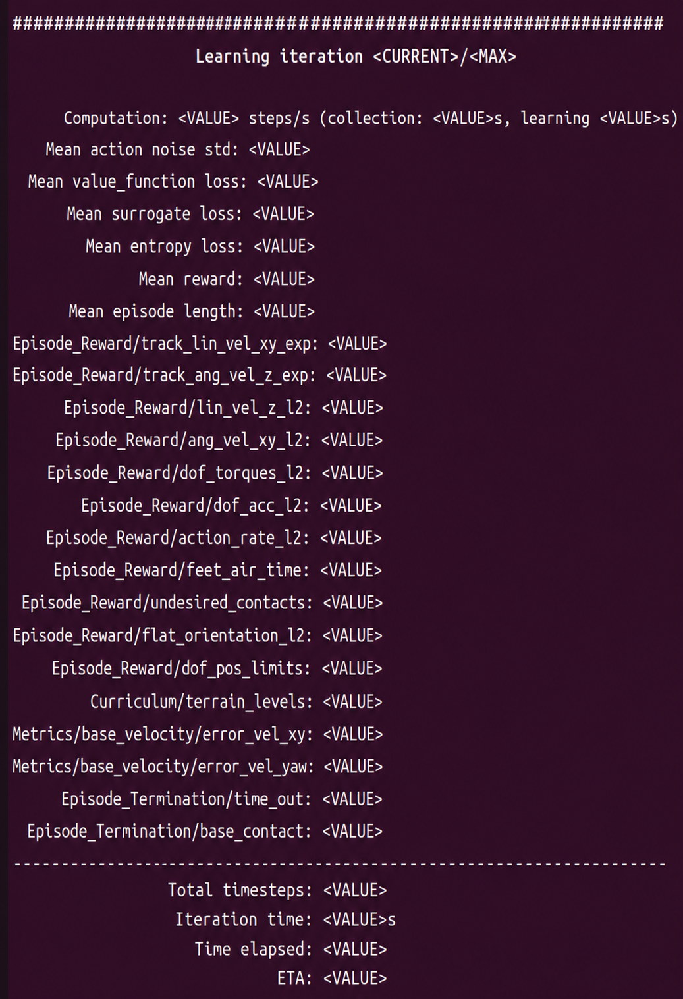
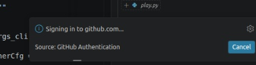

> [!warning] 经验与安全说明
> 本文部分结论与命令来自笔者在特定软硬件版本、项目代码和实验环境中的个人实践，仅供学习与方案参考，不保证适用于其他环境，也不构成法律、专业或安全建议。执行前请核对官方文档、备份数据，并独立评估权限、设备与实验风险。

> [!warning] 版本时效说明
> 本文记录的是特定时期在 Ubuntu、RTX 50 系列、Isaac Sim / Isaac Lab 与 PyTorch Nightly 组合上的安装经验。官方兼容矩阵、驱动、CUDA、wheel 和仓库 tag 都可能变化；命令执行前应重新核对官方文档，并为实际可用版本记录锁文件或完整环境清单。

## 写在前面
- 由于NVIDIA开发的这个仿真框架是在**linux**系统上部署的，而要能够运行这个仿真框架需要极强的渲染和性能，而符合需求的*台式机*或*游戏本*又难免是windows系统，因此需要配置**双系统**来满足日常和科研需求
    - 虚拟机是没有用的，因为它吃不到满载的显卡性能
- 由于写这篇文章的时候，笔者只是大一的小登，对linux系统一概不了解，甚至连*miniconda*和*anaconda*都分不清，还不会写conda的语法。所以在最初配置环境和安装**Isaac Sim/Lab**以及**Torch和Torchvision**的时候几乎是把所有的“底层依赖矛盾”、“版本回滚”和“代码微创”都经历了一遍 😇
- 所以笔者想着，既然已经把 RTX 5080 显卡（Blackwell 架构）在这个特定时期大部分的坑全部踩了一遍，写一份基于以上conditions的教程并避免像笔者一样走弯路是一个比较有意义的事情，如果能够帮助到你，给我的github点个🌟吧:)
### 🌟 核心避雷原则
1. **网络是生命线：** 国内网络下载外网的大文件极易断流，必须全程挂代理，并加大 `pip` 的超时宽容度
2. **无视官方的 2.5.1 规矩：** Isaac Lab 官方文档目前只保证支持到 40 系显卡（cu124）
    - 对于 50系列，**唯一的解药是 `cu128` 的 PyTorch 夜间版（Nightly）**
3. **若非必要，不作任何更新，无论是操作系统还是软件包**：在后续的安装中，很有可能会出现如下显示“不是最新版，待更新”的提示，完全无视！
    
## 第一阶段：地基搭建（基础环境与仓库拉取）
### 1. **★★镇压 Ubuntu 的“无响应”弹窗**
- 在全新 Ubuntu 系统中，当 Isaac Sim 第一次启动编译庞大的着色器（Shaders）时，界面会*假死*
    - Ubuntu 默认只要程序卡住 5 秒就会弹出“强制退出”警告，这极易导致新手误杀进程
{width="474"}

- 打开终端，将无响应的等待时间从默认的 5 秒（5000ms）延长到 60 秒（60000ms）：
```bash
gsettings set org.gnome.mutter check-alive-timeout 60000
```
### 2. 安装基础工具（`Git` & `Miniconda`）
- 在<u>全新</u>的 Ubuntu 终端中依次执行：
```bash
# 更新系统并安装 Git
sudo apt update
sudo apt install git curl build-essential -y

# 安装 Miniconda
# 1. 在你的主目录下创建一个名叫 miniconda3 的文件夹
mkdir -p ~/miniconda3

# 2. 把 Miniconda 的安装包下载到这个文件夹里
wget https://repo.anaconda.com/miniconda/Miniconda3-latest-Linux-x86_64.sh -O ~/miniconda3/miniconda.sh

# 3. 执行静默安装（-b 代表后台无声安装，不需要你干预）
bash ~/miniconda3/miniconda.sh -b -u -p ~/miniconda3

# 4. 安装完后把那个巨大的安装包删掉，节约你宝贵的硬盘空间
rm ~/miniconda3/miniconda.sh

# 5. 把 conda 激活指令写进你系统的启动文件里
~/miniconda3/bin/conda init bash
```

> [!warning] 避雷：miniconda 的“假死”与激活
> 在执行完上述安装 Miniconda 的命令（尤其是包含 `conda init bash` 的脚本）后，Conda 环境并不会立刻生效！
> - **千万不要直接在这个终端里继续往下敲代码！** 
> - **必须执行的操作：** 直接关闭当前终端窗口（点击右上角叉号或输入 `exit`），然后 **重新打开一个全新的终端**（快捷键 `Ctrl + Alt + T`）。
> - **成功的标志：** 只有当你看到新终端输入行的最左侧出现了绿色的 `(base)` 前缀时，才代表 conda 已正式就绪。
### 3. 创建虚拟环境

 <a id="obsidian-block-17c297"></a>

```bash
# 创建并激活 conda 环境
conda create -n isaaclab python=3.10 -y
conda activate isaaclab
```

> [!question] 突发状况：`conda create`时卡死或报错索要“用户协议”怎么办？
> 报错原因：为了区分“免费的学术/个人用途”和“收费的商业用途”，现在的 Conda 在第一次访问官方默认下载频道（channels）时，会强制要求用户明确同意他们的服务条款。
> 解决方案：**依次**复制并运行以下三行命令：
> **1. 接受主频道（main）的服务条款：**
> ```bash
> conda tos accept --override-channels --channel https://repo.anaconda.com/pkgs/main
> ```
> **2. 接受 R 语言频道（r）的服务条款：**
> ```bash
> conda tos accept --override-channels --channel https://repo.anaconda.com/pkgs/r
> ```
> _运行这两条命令后，系统通常会静默通过，或者提示你已经成功接受（Accepted）_
> **3. 继续运行刚才的 `conda create`那行创建虚拟环境的代码**
### 4. 升级`pip`（防雷）
- 很多时候我们遇到奇怪的 `ResolutionImpossible` 报错，不是包冲突，而是你新装的 conda 自带的 `pip` 版本太老，解析不了最新版 PyTorch 复杂的依赖关系树
```bash
python -m pip install --upgrade pip
```
### 5. 预装缺失的联网组件（`requests` 库防崩溃补丁）
> [!tip] 隐蔽的雷区：资产浏览器联网失败
> * 这是一个官方依赖打包时的疏忽：Isaac Sim 在后续启动时，它自带的资产浏览器（Asset Browser，用于加载各种机器狗、机械臂的3D模型）需要联网拉取数据。
> * 如果不提前安装基础的网络爬虫库，后续在终端验证 Python 接口时会爆出一大段红色的 `ModuleNotFoundError: No module named 'requests'` 报错。
> * **趁现在环境刚建好，顺手打上预防针：**
> ```bash
> pip install requests
> ```
>
> 这样可以彻底抹除后续在仿真器里找模型时可能遇到的红字隐患！
### 6. **★★★挂载代理**
> [!warning] 关于挂载代理
> - 为了让你下载IsaacLab更快，留出时间检查后续代理冲突之类的问题，挂VPN加速外网文件的git下载是很重要的
> - 若使用本地代理客户端，请在设置中核对本地监听地址和端口
> - 在 Windows 下，你打开 Clash 开启“系统代理”，所有的软件都会乖乖走代理
> 	- 但在 Linux 下，**终端（Terminal）是非常高傲和固执的**。即使你打开了 Clash 的系统代理，你在终端里敲下的 `git clone` 和 `./isaaclab.sh` 依然会走直连，速度依然是几 KB/s
> 
> <mark>你必须手动把终端“牵”到代理的通道上</mark>

> [!question] 怎么挂载
> - 假设你已经安装好了机场，导入了你的订阅，并且在界面里打开了“System Proxy（系统代理）”。不同代理客户端的本地监听地址和端口可能不同，请以自己的设置为准。
> - 请在你要执行 `git clone` 的那个 **`(isaaclab)`** 终端里，依次执行以下命令：
> 
> **第一步：让当前终端的下载命令走代理**
> ```bash
> # 请先设置 LOCAL_PROXY_HOST 和 LOCAL_PROXY_PORT。
> : "${LOCAL_PROXY_HOST:?请先设置 LOCAL_PROXY_HOST}"
> : "${LOCAL_PROXY_PORT:?请先设置 LOCAL_PROXY_PORT}"
> export http_proxy="http://${LOCAL_PROXY_HOST}:${LOCAL_PROXY_PORT}"
> export https_proxy="http://${LOCAL_PROXY_HOST}:${LOCAL_PROXY_PORT}"
> ```
> 
> - <mark>注意</mark>：这两行命令只在当前这个终端窗口生效，关掉窗口就失效了
> 	- 非常安全，不会影响系统其他部分
> 	- 但是如果你中途退出了之前的终端，后续的安装之前也要先在终端代理好才能下载快
> 
> **第二步：专门给 Git 配置代理（加速你的 git clone）**
> ```bash
> git config --global http.proxy "http://${LOCAL_PROXY_HOST}:${LOCAL_PROXY_PORT}"
> git config --global https.proxy "http://${LOCAL_PROXY_HOST}:${LOCAL_PROXY_PORT}"
> ```

> [!warning] Git 全局代理会持续生效
> `--global` 会影响后续所有 Git 仓库。若只想影响当前命令，优先使用当前 shell 的 `http_proxy` / `https_proxy`；不再需要时可用 `git config --global --unset http.proxy` 和 `git config --global --unset https.proxy` 清除。
## 第二阶段：配置仿真环境——Isaac Sim 4.5.0 世界
### 1. 独立安装 Isaac Sim 4.5.0 本体
指定 NVIDIA 官方源，拉取这个庞大的物理引擎：
```bash
pip install 'isaacsim[all,extscache]==4.5.0' --extra-index-url https://pypi.nvidia.com
```

> [!tip] 💡 Pip 断点续传大法 
> 由于这一步需要从海外服务器拉取几十个 G 的超大核心包，即使挂了代理，在校园网或实验室网络波动时，终端也很容易突然爆出大段红色的 `ReadTimeout` 或 `ConnectionError` 报错，导致下载意外中止
> - **千万不要慌，不需要从头再来！**
> - **如何操作：** 只要终端回到了可以输入命令的状态，直接按键盘上的 **“↑”（上方向键）** 调出刚才那句安装命令，然后再次敲击 **回车（Enter）**
> - **原理解释：** Pip 包管理器极其聪明，它自带本地缓存机制。重新执行命令后，它会自动跳过之前已经下好的几个 G，从断开的地方继续往下无缝下载（断点续传），直到最终出现 `Successfully installed` 为止
### 2. 防崩溃救命血包: 手动配置 32GB Swap 虚拟内存（小RAM用户验证前必做！）

> [!danger] 修改系统级 swap 前先核对
> `/swapfile` 和 `/etc/fstab` 是系统级配置。先用 `swapon --show`、`free -h` 与 `grep -n '/swapfile' /etc/fstab` 检查现状；重复追加 fstab、磁盘空间不足或路径冲突都可能造成启动问题。Swap 只能缓解内存峰值，不能替代足够的 RAM，也不保证解决所有 OOM。

> [!warning] 致命避雷：OOM（内存溢出）强杀警告
> - 很多新手在安装完本体后，第一次运行 `isaacsim` 会遭遇黑屏、无响应，最终终端冷冷地抛出一句“**已杀死 (Killed)**”
> - 这是因为第一次启动时，引擎需要在后台疯狂为你全新的 5080 显卡编译着色器（Compiling Shaders），这会像饿狼一样瞬间吞噬极其庞大的物理内存（RAM）
> 	- 如果你的电脑物理内存只有 16GB 或 32GB，瞬间爆满后 Linux 内核会直接一枪爆头杀掉进程
> - **唯一的解药：从硬盘里划出 32GB 的空间临时当作虚拟内存给系统续命**
- 重新打开一个全新的终端（不需要激活 conda），依次执行以下 5 行命令
    - 遇到输密码的地方正常输入即可，需耐心等待第一步分配空间的几分钟时间
1. 预备 32GB 的硬盘空间来做虚拟内存
```bash
sudo fallocate -l 32G /swapfile
```
2. 设置极其严格的安全权限（防止别人偷看内存数据）
```bash
sudo chmod 600 /swapfile
```
3. 把这个文件格式化为专门的 Swap 格式
```bash
sudo mkswap /swapfile
```
4. 正式激活这个 32GB 的“救命血包”
```bash
sudo swapon /swapfile
```
5. 把它写进系统启动文件（一劳永逸，以后每次开机这 32GB 加持都会自动生效）
    ```bash
    echo '/swapfile none swap sw 0 0' | sudo tee -a /etc/fstab
    ```
_(✅ 执行完毕后，你的电脑相当于拥有了“物理内存 + 32GB 虚拟内存”的恐怖容量，底层内存溢出的隐患已被彻底根除！)_
### 3. 验证 Isaac Sim 安装
安装完成后，直接在终端敲入以下命令启动模拟器:
```bash
isaacsim
```
> [!warning] 避雷：不要恐慌
> 第一次运行此命令时，系统会疯狂拉取依赖扩展。
> 这看起来就像终端卡住了一样，**耗时可能长达 10 分钟以上！** 
> 绝对不要按 `Ctrl+C`！耐心等待，直到弹出一个带有菜单栏的黑色 3D 界面，且最上方明确标有 **”`Isaac Sim Full 4.5.0`“**
> 	注意：当你们看到弹窗中出现*除了左下角坐标轴外*全是黑屏时，这没有出错，而是显示一个空宇宙，看到坐标轴就意味着成功了
> 
> 看到它，地基就打好了，关闭窗口退出。
## 第三阶段：搭建核心框架——Isaac Lab克隆与配置
> [!important] 注意 ***Location***！
> 在执行第三阶段及以后的所有命令（包括 `./isaaclab.sh --install` 和后续运行机器狗的 `train.py`/`play.py`）时，**必须向读者强调，所有的终端命令必须在** **~/IsaacLab** **根目录下执行**，否则不仅会报错，环境绑定也会错位
### 1. 拉取框架并严格锁死版本
```bash
# 回到主目录，克隆官方仓库
cd ~
git clone https://github.com/isaac-sim/IsaacLab.git
cd IsaacLab
git checkout v2.0.2
```

> [!tip] 版本确定后理解Git 的“无能狂怒”：分离头指针（Detached HEAD）
> 在执行完 `git checkout v2.0.2` 后，你的终端大概率会弹出一大串红色或粉红色的警告代码，提示你正处于“分离头指针状态（Detached HEAD）”。你看到满屏红字会瞬间恐慌，以为代码拉取坏了：
> 
> **这不是报错，反而是操作正确的认证！**
> - **这些红字到底是什么？**
> 这其实是 Git 系统的“好心提醒”。在 Git 的逻辑里，平时开发都在一条活跃的“主干道（Branch）”上进行。而像 `v2.0.2` 这样的特定版本号，在 Git 中叫做“标签（Tag）”，它是一个绝对静止、钉死在时间线上的“历史快照”。
> - 为什么会出现这段警告？
> 当你强制切换到 `v2.0.2` 时，Git 实际上是把你从活跃的开发主干道上拉了下来，放到了这个绝对静止的快照上。Git 弹出这堆警告，只是在焦急地提醒你：“嘿！你现在不在开发干道上！如果你在这里修改了底层源码，你的修改是不会被自动保存到主线里的！”
> - ***为什么我们完全不用管它？***
> 因为我们现在的目的仅仅是**完美安装并运行**这个稳定版仿真框架，根本不需要去修改 Isaac Lab 官方的底层源码！所以，这种被 Git 警告的“只能看不能改”的锁定状态，对我们来说恰恰是**最完美、最安全的环境状态**。
> 
> ✅ 只要你看到警告代码的最后一行显示类似 **`HEAD is now at ... Bumps docker and pip version to 2.0.2`** 的字样，就彻底证明版本已经精准对齐，大胆进入下一步!
### 2. 运行 Isaac Lab 安装脚本——把算法框架与刚才装好的地基绑定
- 先用官方脚本把各种繁杂的基础包（比如 `omni` 相关的库）装好：
```bash
./isaaclab.sh --install
```
*(⚠️ 避雷提示：这一步会自动装上不支持 5080 的旧版 PyTorch，并且在结尾必定会报出一堆红色的依赖冲突。**请完全无视它们！**)*
## 第四阶段：解决 5080 依赖冲突的问题

> [!danger] Nightly 与 `--no-deps` 可能破坏现有环境
> 先导出 `conda env export` / `pip freeze` 并记录驱动与 CUDA 信息。Nightly 索引是可变的，`--no-deps` 会绕过依赖解析；仅在官方兼容矩阵与实际报错支持这一方案时使用，并在安装后重新运行导入、CUDA kernel 与仿真测试。
### 1. 彻底拔除旧Torch和Torchvision
```bash
pip uninstall -y torch torchvision torchaudio
pip cache purge
```
> [!tip] 关于`pip cache purge`
> 用于清空卸载部分文件后的残余文件
> 这一步预计能删掉将近几千 MB 的一次性残留文件
### 2. 注入 50 系纯正血脉（cu128 夜间版大脑）
- 加上 `--default-timeout=1000` 防止实验室网络波动导致 **近千MB** 的包下载中断：
```bash
pip --default-timeout=1000 install --pre torch --index-url https://download.pytorch.org/whl/nightly/cu128
```
### 3. 缝合视觉神经（无视依赖检查）
- 由于 `pip` 会自作主张，为了版本对应而把刚装好的夜间版大脑降级
    - 我们必须使用 `--no-deps` （无视依赖）强行把眼睛装上去
```bash
pip install --pre torchvision --index-url https://download.pytorch.org/whl/nightly/cu128 --no-deps
```
_(✅ 至此，`sm_120 is not compatible` 的黄色警告和 `ncclCommInitRankScalable` 的红色崩溃将彻底从你的电脑里绝迹！)_
## 第五阶段：Verifying the Isaac Lab installation 环境与框架的最终验证
> 这一步的目的是跑通官方文档要求的测试代码，确保我们在前两个阶段的配置完美无瑕

> [!tip] 心理准备
> 在整个第五阶段的验证中，你会遇到许多“假报错”，无论是在终端还是在仿真平台：
> 1. 仿真平台“Simulations Output”窗口显示`Properties not updated`：空场景里没有会动的物体，Fabric 高速通道自然不需要更新数据
> 
> *注：这个界面在该版本的IsaacLab是默认显示的，要对照的话可以去软件最上方的菜单栏中，点击 **`Window`**，里面有个Simulation Settings，点击就会弹出*
> 2. `[carb] Failed to find a plugin...`：引擎启动时例行公事地寻找冷门插件（如VR设备），找不到随口抱怨一句而已
> 3. `UserWarning: RNN module weights...`：PyTorch 底层对循环神经网络预留内存的“强迫症”警告，对咱们机器狗的 MLP 线性层大脑毫无影响。
### 1. 基础物理引擎验证（空场景测试）
> 测试底层 3D 渲染和引擎是否能正常启动
```bash
python scripts/tutorials/00_sim/create_empty.py
```
_(如果弹出一个黑色 3D 界面且没有任何红字崩溃报错，按 `Ctrl+C` 退出，进入下一步)_
### 2. 官方仿真训练脚本验证（高负载压力测试）

> [!warning] 从较小并行规模开始
> 并行环境数量不是固定的“甜点值”。它受显存、资产复杂度、观测、网络结构、渲染设置和软件版本共同影响。先从较小值启动，记录显存峰值与稳定性，再逐步上调；不要直接照搬他人的实测数字。

```bash
# 请先根据自己的硬件测试设置，例如：export NUM_ENVS="..."
: "${NUM_ENVS:?请先设置 NUM_ENVS}"
python scripts/reinforcement_learning/rsl_rl/train.py \
  --task Isaac-Velocity-Rough-Anymal-C-v0 \
  --num_envs "${NUM_ENVS}" \
  --headless
```

`--headless` 会关闭可视化窗口，通常可以把更多资源留给仿真和训练。首次验证也可以不加它，观察场景是否正常；确认后再切换到 headless。

> [!note] 公开版说明
> 原笔记曾使用一组具体硬件上的训练截图、吞吐、时长、reward、loss 和 termination 数字解释日志。公开版不展示这些真实实验结果；下图仅保留字段结构，并用占位符替换全部实验数值。



> [!questions] 什么是 iteration？并行环境如何训练一个策略？
> - Isaac Lab 常用向量化环境同时运行许多环境实例。标准设置下，这些环境**共享同一套 policy 参数**，并不是“每个环境各有一个大脑”。它们并行产生 rollout，用来组成一次更新的数据批次。
> - 一次训练 iteration 通常先让每个环境收集固定长度的 control steps，再把所有环境的样本合并，随后执行一次或多次优化 epoch。具体 rollout 长度、mini-batch 和更新次数由 runner / agent 配置决定。
> - **control step 与 physics step 不是同一个概念。** 一个控制步可能通过 decimation 包含多个物理子步，常见关系是 `control_dt = physics_dt × decimation`。日志里的 `steps/s` 究竟统计物理步、控制步还是聚合后的 environment steps，必须查看当前版本的 logger 实现。
> - Actor 根据 observation 产生 action；Critic 估计当前 policy 下的价值。优化器利用 rollout 计算的 return / advantage 更新共享的 Actor 与 Critic。

> [!question] 新的 iteration 开始时，所有环境都会重置吗？
> 通常不会。iteration 是收集与优化的边界，不等于 episode 边界。各环境实例会在自己的 termination 或 truncation 条件触发时异步重置；同一批次中，一部分环境可能刚重置，其他环境仍在延续原 episode。若某个仓库实现了同步重置，则应以该环境代码为准。

> [!abstract] 如何阅读训练日志而不过度解读？
> 1. **吞吐与耗时：** 先确认 logger 对 step 的定义，再比较相同任务、相同并行规模和相同渲染设置下的结果。
> 2. **episode length：** 它受 termination、truncation、控制频率和统计窗口影响，不能脱离配置直接换算成“存活秒数”。
> 3. **termination 统计：** 各 termination term 可能在同一 transition 同时成立，也可能分别按窗口聚合，因此它们不一定是互斥百分比，数值之和可以大于 1。需要查看 termination manager 和 logger 的具体归一化方式。
> 4. **reward 分项：** 数值取决于权重、尺度与聚合方式，只能在配置一致时比较；单项变大不自动等于策略更好。
> 5. **value / surrogate loss：** 没有脱离算法与实现的通用“越小越好”阈值。应结合回报、KL、entropy、clip fraction、独立评估和行为回放判断。
> 6. **事实与推测分开：** 日志字段、计算公式和终止条件可以从代码确认；“策略已经学会稳定行走”等结论则必须由独立 rollout、视频和评估统计支持。

### 3. 检验仿真结果（推理）阶段的“防闪退补丁”与控制台优化（验证前的必要修改）
> 如果当前版本的 `play.py` 在模型导出阶段出现可复现的硬件或依赖报错，而这次验证并不需要导出文件，可以先备份源码，再临时跳过导出步骤。不要把这一处理视为所有版本都必须执行的补丁。
```bash
gedit scripts/reinforcement_learning/rsl_rl/play.py
```
- **Options**：这里也可以选择用 VS Code 打开代码文件，文件位置在`scripts/reinforcement_learning/rsl_rl/play.py`（如上述代码）
> [!tip] 关于在 Linux 系统中用 VS Code 处理代码文件的登录 GitHub 账号问题
> - 在 Ubuntu 等 Linux 操作系统中，VS Code 登录 GitHub 时卡在 “Signing in to github.com...” 是一个**非常经典且高发**的现象：
> 
> - 这通常不是网络问题，而是因为 Linux 的**安全钥匙串（Keyring）管理机制**不兼容，或者系统的 **URL 协议跳转（Protocol Handler）** 被系统或沙盒环境（如 Snap）拦截了，导致浏览器完成授权后，无法把“登录凭证”传回给 VS Code。
> - 我的方案：
> 	- 使用“设备码（Device Code）”绕过自动跳转
> 	- 这是最不折腾系统配置的权宜之计。如果自动跳转卡死，我们可以手动输入代码登录。
> 		1. **取消当前登录：** 在右下角提示框中点击 **Cancel** 终止当前卡死的登录。
> 		2. **触发备用登录：** 再次点击左下角的“账户”图标选择登录，或者在点击登录后，留意右下角或顶部弹窗。VS Code 通常会检测到跳转失败，并弹出一个提示：_“Having trouble logging in? Click here to use a device code...”_（遇到登录困难？点击此处使用设备码）。
> 		3. **使用设备码：** 点击它，VS Code 会给你一段形如 `XXXX-XXXX` 的代码，并弹出一个 GitHub 网页（[github.com/login/device](https://github.com/login/device)）。
> 	- 在网页中输入这段代码，点击授权。完成后，VS Code 会瞬间直接登录成功，完全不需要系统钥匙串的干预。
#### 若当前版本确实在导出阶段报错：临时跳过导出代码
> [!warning] 只在堆栈明确指向导出阶段时使用
> 先备份文件或创建 Git 分支，并确认当前验证不需要导出产物。代码行号会随版本变化，应按函数名定位；测试完成后恢复修改。若错误来自模型本身、依赖或输入 shape，注释导出并不会修复根因。

```python
# export_model_dir = os.path.join(os.path.dirname(resume_path),"exported")
# export_policy_as_jit(...)
# export_policy_as_onnx(...)
```

> [!abstract] `play.py` 是怎么起作用的？
> - 推理文件的设计初衷是“全自动的防呆测试”。
> - 在代码底层的`Command Manager`里，它绑定了一个叫`UniformVelocityCommandGenerator`的组件。这个组件会每隔几秒钟就给狗下达一段随机的速度指令，目的是测试刚刚训练出的神经网络在面对各种刁钻指令能不能保持平衡。
> - 完全无需人类操控来检验。
### 4. 终极实战验证（推理播放）
> 代码修补完毕，运行刚才训练出的模型进行最终的交互验证：
```bash
python scripts/reinforcement_learning/rsl_rl/play.py --task=Isaac-Velocity-Rough-Anymal-C-v0 --num_envs=1
```
- 同理，这里的最后加上了 `--num_envs=1`，是为了更加方便地查看机器狗的训练效果
- 当然了，以后迭代次数更加多了以后，机器狗可以适应更多地形了，那可以同时在不同的地形生成更多数量的机器狗，来全面查看训练的成果
