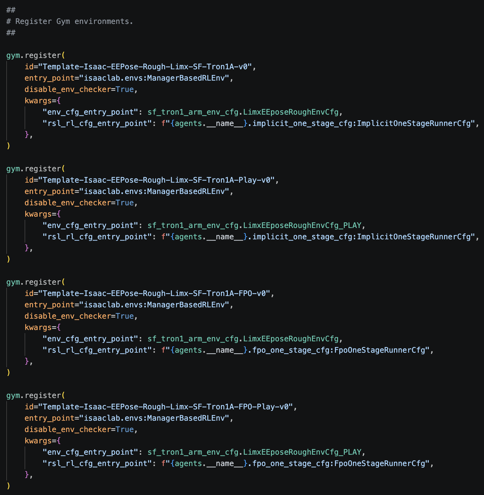
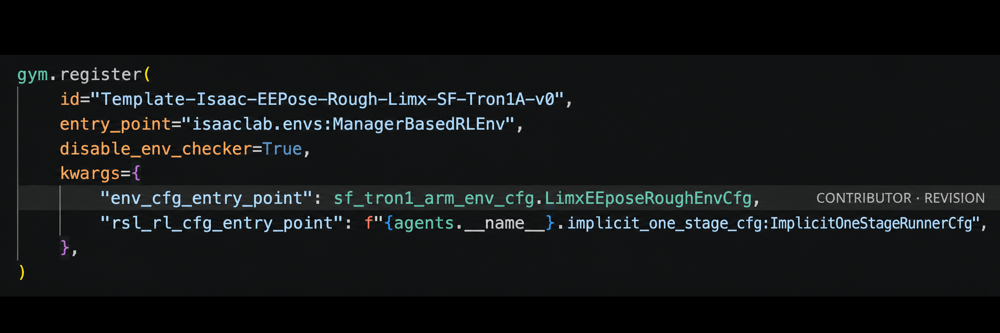
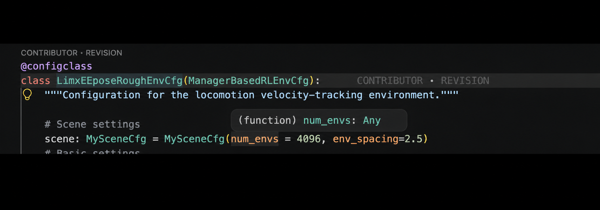
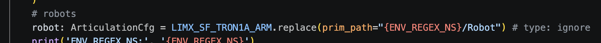
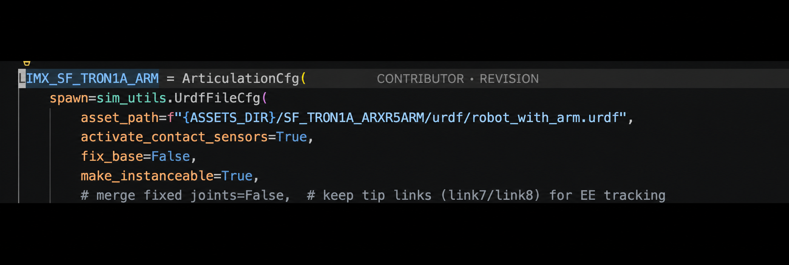

> [!warning] 阅读说明
> 本文是笔者基于特定课程、项目代码与个人学习过程整理的工作笔记。部分论断可能不完整、过时或依赖特定版本，请结合原始论文、官方文档及实际源码独立核验。

> [!warning] 版本依赖
> 以下 task → environment config → scene → robot asset 的追踪链条基于特定仓库版本；目录、注册名和类名在不同提交中可能变化，请以实际代码为准。

首先，明确在该项目仓库下，task在以下两个路径被确定：
```
# 训练普通足式机器人（SF）
<PROJECT_ROOT>/source/ext_loco/tasks/loco_manipulation/EE_pose/config/sf_tron1_arm/__init__.py

# 训练轮足机器人（WF）
<PROJECT_ROOT>/source/ext_loco/tasks/loco_manipulation/EE_pose/config/wf_tron1_arm/__init__.py
```
## 以SF_Tron1_Arm为例
- 如图：


- 这里的四个注册了的task分别代表（从上到下）：
    - 用于SF正式训练
    - 用于训练完的SF进行推理
    - 用于SF的FPO训练
    - 用于SF进行FPO训练后的推理
### 每一个task使用的具体是哪一款带臂机器人？详细流程：
1. 在task的注册表 `__init__.py` 中*找到 `kwargs`字典*
{.trim-black-padding .trim-black-padding--register}

2. 找到关于环境定义的 `env_cfg_entry_point` 这个键，按住Ctrl，左键点击 `LimxEEPoseRoughEnvCfg` 这个值（全值是 `sf_tron1_arm_env_cfg.LimxEEPoseRoughEnvCfg`），跳转到环境定义文件中**总环境**定义的**主代码**
3. 在主代码中，找到**scene**的定义，如图可以看出这里使用的场景是`MySceneCfg`
    - Scene的定义中包含使用的机器人
{.trim-black-padding .trim-black-padding--scene}

4. 按住Ctrl左键点击 `MySceneCfg` 跳转到对 `MySceneCfg` 的定义代码处，在 `# robots` 的注释下方是选择具体机器人的代码，可以看到这个task要求加载的机器人配置
    - 如图我们可以看到使用的是 `LIMX_SF_TRON1A_ARM`


5. 要查看`LIMX_SF_TRON1A_ARM`的具体信息，在 `sf_tron1_arm_env_cfg` 的顶部找到{width="484"}
    - 这说明`LIMX_SF_TRON1A_ARM` 的信息定义在 `<PROJECT_ROOT>/source/ext_loco/assets/limx.py`
    - 要找到该机器人对应的配置文件，在 `limx.py` 文件里搜该机器人的名字如`LIMX_SF_TRON1A_ARM` 
    - {width="578" .trim-black-padding .trim-black-padding--asset}
    - 会看到 `assets/SF_TRON1A_ARXR5ARM/urdf/robot_with_arm.urdf` 就是该机器人的URDF配置文件了
