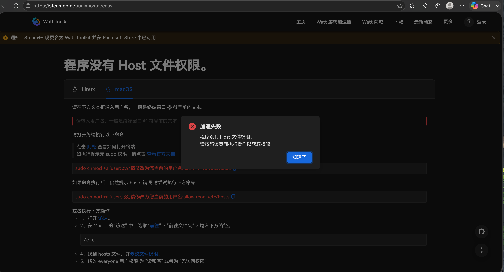
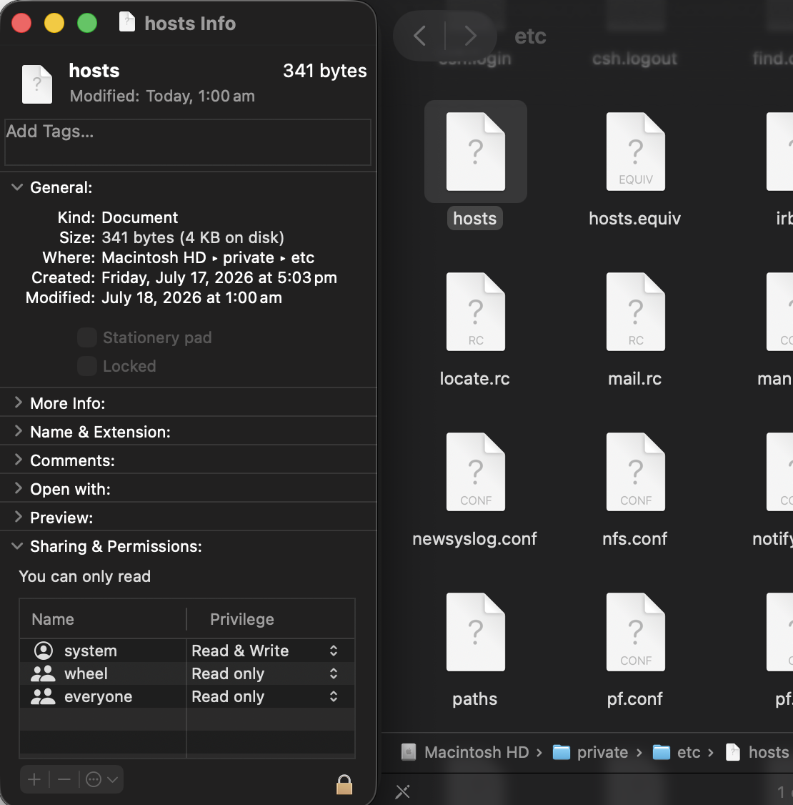

# Watt Toolkit（Steam++）Mac 端 hosts 权限配置指南

## 问题说明

运行 Watt Toolkit（原 Steam++）时，软件可能因无法修改系统 `hosts` 文件而报错，导致加速、社区解锁等功能失效。这是因为 macOS 的安全机制默认限制普通用户写入系统核心网络文件，并非软件故障。



## 前置问题：首次打开应用被拦截

若首次打开软件时弹出“无法验证开发者 / Apple cannot verify”提示：

1. 右键点击应用图标，选择 **打开 / Open**，在二次确认弹窗中再次点击 **打开 / Open**。
2. 也可打开 **系统设置 → 隐私与安全性 / System Settings → Privacy & Security**，在页面底部点击 **仍要打开 / Allow Anyway**。

## 方法一：通过图形界面配置权限

1. 打开 Finder，点击顶部菜单栏 **前往 → 前往文件夹 / Go → Go to Folder**（快捷键 `Shift + Command + G`）。
2. 在弹窗中输入 `/etc` 并回车，打开系统的 `etc` 文件夹。
3. 找到 `hosts` 文件，右键点击并选择 **显示简介 / Get Info**。
4. 下拉到 **共享与权限 / Sharing & Permissions** 区域：
    - 点击右下角的锁形图标，输入开机密码以解锁权限设置。
    - 点击 `+` 按钮，添加当前用户账号，并将权限设置为 **读与写 / Read & Write**。
    - （不推荐）也可直接将 `everyone` 的权限修改为 **读与写 / Read & Write**，但这会降低系统安全性。
5. 关闭窗口后重启 Watt Toolkit 即可生效。



## 方法二：通过终端命令配置（推荐）

!!! tip "遵循最小权限原则"

    此方法仅为当前用户单独授予权限，不开放全局权限，安全性更高。

1. 打开“终端 / Terminal”，输入 `whoami` 并回车，查看当前用户名（例如 `edwin`）。
2. 将下方命令中的 `your_username` 替换为实际用户名。执行后输入开机密码（输入时不会显示字符），再按回车确认：

    ```bash
    sudo chmod +a 'user:your_username:allow write' /etc/hosts
    ```

3. 若仍提示读取权限错误，再执行以下命令：

    ```bash
    sudo chmod +a 'user:your_username:allow read' /etc/hosts
    ```

## 使用后恢复：还原 hosts 文件的默认安全权限

`/etc/hosts` 是系统核心网络文件，长期开放写入权限存在安全风险。不需要使用软件时，建议恢复默认配置。

### 通过图形界面恢复

1. 再次打开 `hosts` 文件的 **显示简介 / Get Info** 窗口，解锁权限设置。
2. 在权限列表中选中手动添加的用户账号，点击 `-` 按钮将其删除。
3. 将 `everyone` 的权限改回 **只读 / Read only**。

### 通过终端命令恢复

将 `your_username` 替换为实际用户名后，依次执行：

```bash
# 移除写入授权 / Remove write permission
sudo chmod -a 'user:your_username:allow write' /etc/hosts
# 移除读取授权（若之前添加过）/ Remove read permission (if added before)
sudo chmod -a 'user:your_username:allow read' /etc/hosts
# 恢复系统标准权限配置 / Restore system standard permission settings
sudo chmod 644 /etc/hosts
sudo chown root:wheel /etc/hosts
```

## 注意事项 / Notes

1. 请勿手动修改 `hosts` 文件中的文本内容；Watt Toolkit 会自动在文件末尾管理加速规则。
2. 优先为单独用户授权，不建议直接向 `everyone` 开放读写权限。遵循最小权限原则更安全。
3. 请从官方渠道下载 Watt Toolkit 安装包，避免使用可能存在安全风险的第三方安装包。
